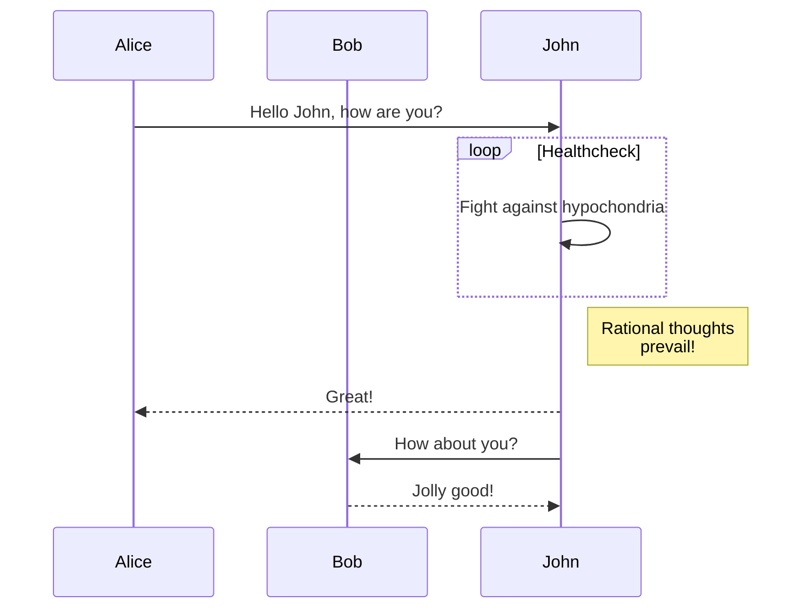
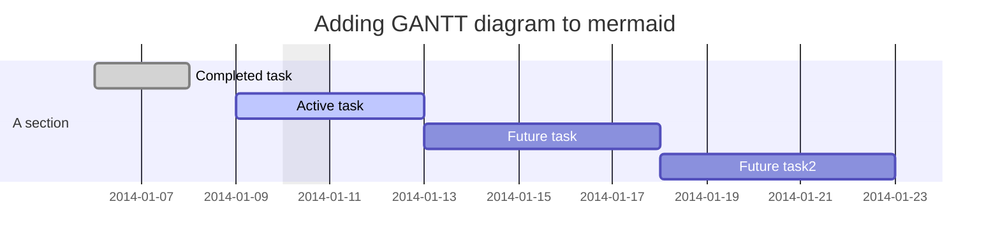
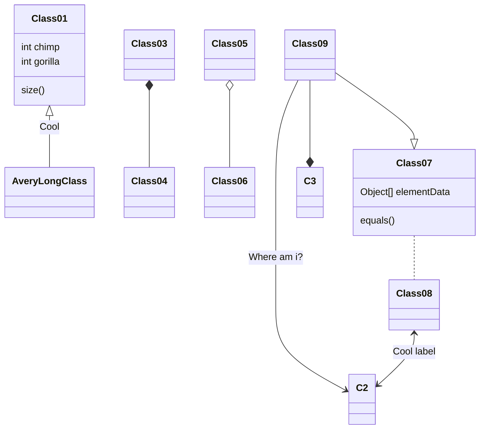
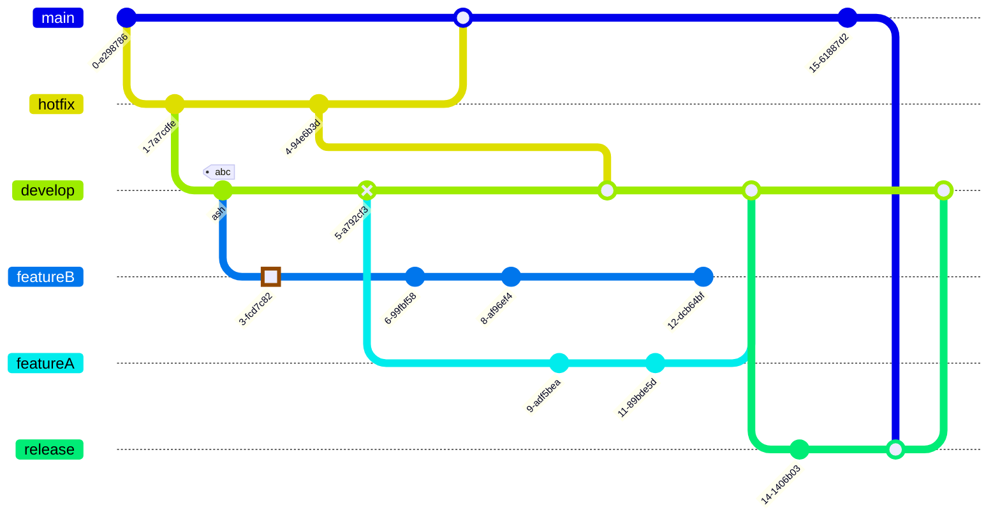
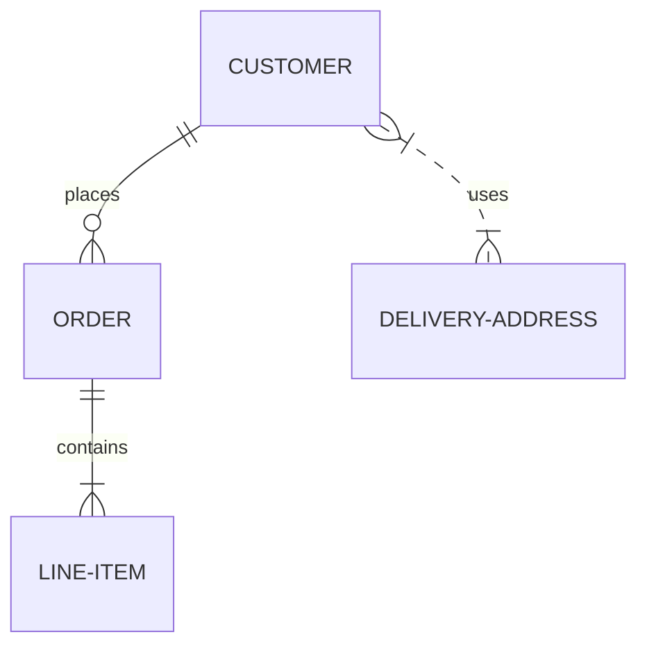
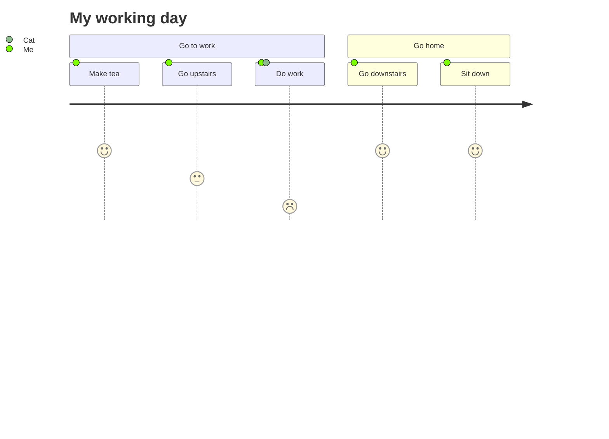

This article offers a sample of basic Markdown syntax that can be used in Hugo content files.

<!--more-->


This article is a shameful copy of the great [Grav original page](http://learn.getgrav.org/content/markdown).

If you want to know about the extended Markdown syntax of **LoveIt** theme, please read [extended Markdown syntax page](../theme-documentation-content#extended-markdown-syntax).


Let's face it: Writing content for the Web is tiresome. WYSIWYG editors help alleviate this task, but they generally result in horrible code, or worse yet, ugly web pages.

**Markdown** is a better way to write **HTML**, without all the complexities and ugliness that usually accompanies it.

Some of the key benefits are:

1. Markdown is simple to learn, with minimal extra characters, so it's also quicker to write content.
2. Less chance of errors when writing in Markdown.
3. Produces valid XHTML output.
4. Keeps the content and the visual display separate, so you cannot mess up the look of your site.
5. Write in any text editor or Markdown application you like.
6. Markdown is a joy to use!

John Gruber, the author of Markdown, puts it like this:

> The overriding design goal for Markdown’s formatting syntax is to make it as readable as possible.
> The idea is that a Markdown-formatted document should be publishable as-is, as plain text,
> without looking like it’s been marked up with tags or formatting instructions.
> While Markdown’s syntax has been influenced by several existing text-to-HTML filters,
> the single biggest source of inspiration for Markdown’s syntax is the format of plain text email.
>
> -- _John Gruber_

Without further delay, let us go over the main elements of Markdown and what the resulting HTML looks like!


:(far fa-bookmark fa-fw): Bookmark this page for easy future reference!


## 1 Headings

Headings from `h2` through `h6` are constructed with a `#` for each level:

```markdown
## h2 Heading
### h3 Heading
#### h4 Heading
##### h5 Heading
###### h6 Heading
```

The HTML looks like this:

```html
<h2>h2 Heading</h2>
<h3>h3 Heading</h3>
<h4>h4 Heading</h4>
<h5>h5 Heading</h5>
<h6>h6 Heading</h6>
```


To add a custom heading ID, enclose the custom ID in curly braces on the same line as the heading:

```markdown
### A Great Heading {#custom-id}
```

The HTML looks like this:

```html
<h3 id="custom-id">A Great Heading</h3>
```


## 2 Comments

Comments should be HTML compatible.

```html
<!--
This is a comment
-->
```

Comment below should **NOT** be seen:

<!--
This is a comment
-->

## 3 Horizontal Rules

The HTML `<hr>` element is for creating a "thematic break" between paragraph-level elements.
In Markdown, you can create a `<hr>` with any of the following:

* `___`: three consecutive underscores
* `---`: three consecutive dashes
* `***`: three consecutive asterisks

The rendered output looks like this:

___
---
***

## 4 Body Copy

Body copy written as normal, plain text will be wrapped with `<p></p>` tags in the rendered HTML.

So this body copy:

```markdown
Lorem ipsum dolor sit amet, graecis denique ei vel, at duo primis mandamus. Et legere ocurreret pri,
animal tacimates complectitur ad cum. Cu eum inermis inimicus efficiendi. Labore officiis his ex,
soluta officiis concludaturque ei qui, vide sensibus vim ad.
```

The HTML looks like this:

```html
<p>Lorem ipsum dolor sit amet, graecis denique ei vel, at duo primis mandamus. Et legere ocurreret pri, animal tacimates complectitur ad cum. Cu eum inermis inimicus efficiendi. Labore officiis his ex, soluta officiis concludaturque ei qui, vide sensibus vim ad.</p>
```

A **line break** can be done with one blank line.

## 5 Inline HTML

If you need a certain HTML tag (with a class) you can simply use HTML:

```html
Paragraph in Markdown.

<div class="class">
    This is <b>HTML</b>
</div>

Paragraph in Markdown.
```

## 6 Emphasis

### Bold

For emphasizing a snippet of text with a heavier font-weight.

The following snippet of text is **rendered as bold text**.

```markdown
**rendered as bold text**
__rendered as bold text__
```

The HTML looks like this:

```html
<strong>rendered as bold text</strong>
```

### Italics

For emphasizing a snippet of text with italics.

The following snippet of text is _rendered as italicized text_.

```markdown
*rendered as italicized text*
_rendered as italicized text_
```

The HTML looks like this:

```html
<em>rendered as italicized text</em>
```

### Strikethrough

In [[GFM]^(GitHub flavored Markdown)](https://github.github.com/gfm/) you can do strikethroughs.

```markdown
~~Strike through this text.~~
```

The rendered output looks like this:

~~Strike through this text.~~

The HTML looks like this:

```html
<del>Strike through this text.</del>
```

### Combination

Bold, italics, and strikethrough can be used in combination.

```markdown
***bold and italics***
~~**strikethrough and bold**~~
~~*strikethrough and italics*~~
~~***bold, italics and strikethrough***~~
```

The rendered output looks like this:

***bold and italics***

~~**strikethrough and bold**~~

~~*strikethrough and italics*~~

~~***bold, italics and strikethrough***~~

The HTML looks like this:

```html
<em><strong>bold and italics</strong></em>
<del><strong>strikethrough and bold</strong></del>
<del><em>strikethrough and italics</em></del>
<del><em><strong>bold, italics and strikethrough</strong></em></del>
```

## 7 Blockquotes

For quoting blocks of content from another source within your document.

Add `>` before any text you want to quote:

```markdown
> **Fusion Drive** combines a hard drive with a flash storage (solid-state drive) and presents it as a single logical volume with the space of both drives combined.
```

The rendered output looks like this:

> **Fusion Drive** combines a hard drive with a flash storage (solid-state drive) and presents it as a single logical volume with the space of both drives combined.

The HTML looks like this:

```html
<blockquote>
  <p>
    <strong>Fusion Drive</strong> combines a hard drive with a flash storage (solid-state drive) and presents it as a single logical volume with the space of both drives combined.
  </p>
</blockquote>
```

Blockquotes can also be nested:

```markdown
> Donec massa lacus, ultricies a ullamcorper in, fermentum sed augue.
Nunc augue augue, aliquam non hendrerit ac, commodo vel nisi.
>> Sed adipiscing elit vitae augue consectetur a gravida nunc vehicula. Donec auctor
odio non est accumsan facilisis. Aliquam id turpis in dolor tincidunt mollis ac eu diam.
```

The rendered output looks like this:

> Donec massa lacus, ultricies a ullamcorper in, fermentum sed augue.
Nunc augue augue, aliquam non hendrerit ac, commodo vel nisi.
>> Sed adipiscing elit vitae augue consectetur a gravida nunc vehicula. Donec auctor
odio non est accumsan facilisis. Aliquam id turpis in dolor tincidunt mollis ac eu diam.

## 8 Lists

### Unordered

A list of items in which the order of the items does not explicitly matter.

You may use any of the following symbols to denote bullets for each list item:

```markdown
* valid bullet
- valid bullet
+ valid bullet
```

For example:

```markdown
* Lorem ipsum dolor sit amet
* Consectetur adipiscing elit
* Integer molestie lorem at massa
* Facilisis in pretium nisl aliquet
* Nulla volutpat aliquam velit
  * Phasellus iaculis neque
  * Purus sodales ultricies
  * Vestibulum laoreet porttitor sem
  * Ac tristique libero volutpat at
* Faucibus porta lacus fringilla vel
* Aenean sit amet erat nunc
* Eget porttitor lorem
```

The rendered output looks like this:

* Lorem ipsum dolor sit amet
* Consectetur adipiscing elit
* Integer molestie lorem at massa
* Facilisis in pretium nisl aliquet
* Nulla volutpat aliquam velit
  * Phasellus iaculis neque
  * Purus sodales ultricies
  * Vestibulum laoreet porttitor sem
  * Ac tristique libero volutpat at
* Faucibus porta lacus fringilla vel
* Aenean sit amet erat nunc
* Eget porttitor lorem

The HTML looks like this:

```html
<ul>
  <li>Lorem ipsum dolor sit amet</li>
  <li>Consectetur adipiscing elit</li>
  <li>Integer molestie lorem at massa</li>
  <li>Facilisis in pretium nisl aliquet</li>
  <li>Nulla volutpat aliquam velit
    <ul>
      <li>Phasellus iaculis neque</li>
      <li>Purus sodales ultricies</li>
      <li>Vestibulum laoreet porttitor sem</li>
      <li>Ac tristique libero volutpat at</li>
    </ul>
  </li>
  <li>Faucibus porta lacus fringilla vel</li>
  <li>Aenean sit amet erat nunc</li>
  <li>Eget porttitor lorem</li>
</ul>
```

### Ordered

A list of items in which the order of items does explicitly matter.

```markdown
1. Lorem ipsum dolor sit amet
2. Consectetur adipiscing elit
3. Integer molestie lorem at massa
4. Facilisis in pretium nisl aliquet
5. Nulla volutpat aliquam velit
6. Faucibus porta lacus fringilla vel
7. Aenean sit amet erat nunc
8. Eget porttitor lorem
```

The rendered output looks like this:

1. Lorem ipsum dolor sit amet
2. Consectetur adipiscing elit
3. Integer molestie lorem at massa
4. Facilisis in pretium nisl aliquet
5. Nulla volutpat aliquam velit
6. Faucibus porta lacus fringilla vel
7. Aenean sit amet erat nunc
8. Eget porttitor lorem

The HTML looks like this:

```html
<ol>
  <li>Lorem ipsum dolor sit amet</li>
  <li>Consectetur adipiscing elit</li>
  <li>Integer molestie lorem at massa</li>
  <li>Facilisis in pretium nisl aliquet</li>
  <li>Nulla volutpat aliquam velit</li>
  <li>Faucibus porta lacus fringilla vel</li>
  <li>Aenean sit amet erat nunc</li>
  <li>Eget porttitor lorem</li>
</ol>
```


If you just use `1.` for each number, Markdown will automatically number each item. For example:

```markdown
1. Lorem ipsum dolor sit amet
1. Consectetur adipiscing elit
1. Integer molestie lorem at massa
1. Facilisis in pretium nisl aliquet
1. Nulla volutpat aliquam velit
1. Faucibus porta lacus fringilla vel
1. Aenean sit amet erat nunc
1. Eget porttitor lorem
```

The rendered output looks like this:

1. Lorem ipsum dolor sit amet
1. Consectetur adipiscing elit
1. Integer molestie lorem at massa
1. Facilisis in pretium nisl aliquet
1. Nulla volutpat aliquam velit
1. Faucibus porta lacus fringilla vel
1. Aenean sit amet erat nunc
1. Eget porttitor lorem


### Task Lists

Task lists allow you to create a list of items with checkboxes. To create a task list, add dashes (`-`) and brackets with a space (`[ ]`) before task list items. To select a checkbox, add an x in between the brackets (`[x]`).

```markdown
- [x] Write the press release
- [ ] Update the website
- [ ] Contact the media
```

The rendered output looks like this:

- [x] Write the press release
- [ ] Update the website
- [ ] Contact the media

## 9 Code

### Inline Code

Wrap inline snippets of code with <code>`</code>.

```markdown
In this example, `<section></section>` should be wrapped as **code**.
```

The rendered output looks like this:

In this example, `<section></section>` should be wrapped as **code**.

The HTML looks like this:

```html
<p>
  In this example, <code>&lt;section&gt;&lt;/section&gt;</code> should be wrapped with <strong>code</strong>.
</p>
```

### Indented Code

Or indent several lines of code by at least four spaces, as in:

```markdown
    // Some comments
    line 1 of code
    line 2 of code
    line 3 of code
```

The rendered output looks like this:

    // Some comments
    line 1 of code
    line 2 of code
    line 3 of code

The HTML looks like this:

```html
<pre>
  <code>
    // Some comments
    line 1 of code
    line 2 of code
    line 3 of code
  </code>
</pre>
```

### Block Fenced Code

Use "fences" <code>```</code> to block in multiple lines of code with a language attribute.


```markdown
Sample text here...
```


The HTML looks like this:

```html
<pre language-html>
  <code>Sample text here...</code>
</pre>
```

### Syntax Highlighting

[GFM]^(GitHub Flavored Markdown) also supports syntax highlighting.

To activate it, simply add the file extension of the language you want to use directly after the first code "fence",
<code>```js</code>, and syntax highlighting will automatically be applied in the rendered HTML.

For example, to apply syntax highlighting to JavaScript code:


```js
grunt.initConfig({
  assemble: {
    options: {
      assets: 'docs/assets',
      data: 'src/data/*.{json,yml}',
      helpers: 'src/custom-helpers.js',
      partials: ['src/partials/**/*.{hbs,md}']
    },
    pages: {
      options: {
        layout: 'default.hbs'
      },
      files: {
        './': ['src/templates/pages/index.hbs']
      }
    }
  }
};
```


The rendered output looks like this:

```js
grunt.initConfig({
  assemble: {
    options: {
      assets: 'docs/assets',
      data: 'src/data/*.{json,yml}',
      helpers: 'src/custom-helpers.js',
      partials: ['src/partials/**/*.{hbs,md}']
    },
    pages: {
      options: {
        layout: 'default.hbs'
      },
      files: {
        './': ['src/templates/pages/index.hbs']
      }
    }
  }
};
```


[Syntax highlighting page](https://gohugo.io/content-management/syntax-highlighting/) in **Hugo** Docs introduces more about syntax highlighting, including highlight shortcode.


## 10 Tables

Tables are created by adding pipes as dividers between each cell, and by adding a line of dashes (also separated by bars) beneath the header. Note that the pipes do not need to be vertically aligned.

```markdown
| Option | Description |
| ------ | ----------- |
| data   | path to data files to supply the data that will be passed into templates. |
| engine | engine to be used for processing templates. Handlebars is the default. |
| ext    | extension to be used for dest files. |
```

The rendered output looks like this:

| Option | Description |
| ------ | ----------- |
| data   | path to data files to supply the data that will be passed into templates. |
| engine | engine to be used for processing templates. Handlebars is the default. |
| ext    | extension to be used for dest files. |

The HTML looks like this:

```html
<table>
  <thead>
    <tr>
      <th>Option</th>
      <th>Description</th>
    </tr>
  </thead>
  <tbody>
    <tr>
      <td>data</td>
      <td>path to data files to supply the data that will be passed into templates.</td>
    </tr>
    <tr>
      <td>engine</td>
      <td>engine to be used for processing templates. Handlebars is the default.</td>
    </tr>
    <tr>
      <td>ext</td>
      <td>extension to be used for dest files.</td>
    </tr>
  </tbody>
</table>
```


Adding a colon on the right side of the dashes below any heading will right align text for that column.

Adding colons on both sides of the dashes below any heading will center align text for that column.

```markdown
| Option | Description |
|:------:| -----------:|
| data   | path to data files to supply the data that will be passed into templates. |
| engine | engine to be used for processing templates. Handlebars is the default. |
| ext    | extension to be used for dest files. |
```

The rendered output looks like this:

| Option | Description |
|:------:| -----------:|
| data   | path to data files to supply the data that will be passed into templates. |
| engine | engine to be used for processing templates. Handlebars is the default. |
| ext    | extension to be used for dest files. |


## 11 Links {#links}

### Basic Link

```markdown
<https://assemble.io>
<contact@revolunet.com>
[Assemble](https://assemble.io)
```

The rendered output looks like this (hover over the link, there is no tooltip):

<https://assemble.io>

<contact@revolunet.com>

[Assemble](https://assemble.io)

The HTML looks like this:

```html
<a href="https://assemble.io">https://assemble.io</a>
<a href="mailto:contact@revolunet.com">contact@revolunet.com</a>
<a href="https://assemble.io">Assemble</a>
```

### Add a Title

```markdown
[Upstage](https://github.com/upstage/ "Visit Upstage!")
```

The rendered output looks like this (hover over the link, there should be a tooltip):

[Upstage](https://github.com/upstage/ "Visit Upstage!")

The HTML looks like this:

```html
<a href="https://github.com/upstage/" title="Visit Upstage!">Upstage</a>
```

### Named Anchors

Named anchors enable you to jump to the specified anchor point on the same page. For example, each of these chapters:

```markdown
## Table of Contents
  * [Chapter 1](#chapter-1)
  * [Chapter 2](#chapter-2)
  * [Chapter 3](#chapter-3)
```

will jump to these sections:

```markdown
## Chapter 1 <a id="chapter-1"></a>
Content for chapter one.

## Chapter 2 <a id="chapter-2"></a>
Content for chapter one.

## Chapter 3 <a id="chapter-3"></a>
Content for chapter one.
```


The specific placement of the anchor tag seems to be arbitrary. They are placed inline here since it seems to be unobtrusive, and it works.


## 12 Footnotes

Footnotes allow you to add notes and references without cluttering the body of the document. When you create a footnote, a superscript number with a link appears where you added the footnote reference. Readers can click the link to jump to the content of the footnote at the bottom of the page.

To create a footnote reference, add a caret and an identifier inside brackets (`[^1]`). Identifiers can be numbers or words, but they can’t contain spaces or tabs. Identifiers only correlate the footnote reference with the footnote itself — in the output, footnotes are numbered sequentially.

Add the footnote using another caret and number inside brackets with a colon and text (`[^1]: My footnote.`). You don’t have to put footnotes at the end of the document. You can put them anywhere except inside other elements like lists, block quotes, and tables.

```markdown
This is a digital footnote[^1].
This is a footnote with "label"[^label]

[^1]: This is a digital footnote
[^label]: This is a footnote with "label"
```

This is a digital footnote[^1].

This is a footnote with "label"[^label]

[^1]: This is a digital footnote
[^label]: This is a footnote with "label"

## 13 Images

Images have a similar syntax to links but include a preceding exclamation point.

```markdown

```


or:

```markdown

```


Like links, images also have a footnote style syntax:

```markdown
![Alt text][id]
```

![Alt text][id]

With a reference later in the document defining the URL location:

```markdown
[id]: https://octodex.github.com/images/dojocat.jpg  "The Dojocat"
```

[id]: https://octodex.github.com/images/dojocat.jpg  "The Dojocat"


**LoveIt** theme has [special shortcode for image](../theme-documentation-extended-shortcodes#image), which provides more features.


<video src="Unlike_Pluto-Searching_For_You.mp4" controls></video>


---
---
---
---
---
---
---
---
---
---
---
---
---
---
---
---
---
---
---
---
---
---
---
---
---
---
---


Emoji can be enabled in a Hugo project in a number of ways.

<!--more-->

The [`emojify`](https://gohugo.io/functions/emojify/) function can be called directly in templates or [Inline Shortcodes](https://gohugo.io/templates/shortcode-templates#inline-shortcodes).

To enable emoji globally, set `enableEmoji` to `true` in your [site configuration](https://gohugo.io/getting-started/configuration/) and then you can type emoji shorthand codes directly in content files.

These begin and end with a **colon** and include the **code** of an emoji:

```markdown
Gone camping! {?:}tent: Be back soon.

That is so funny! {?:}joy:
```

The rendered output looks like this:

Gone camping! :tent: Be back soon.

That is so funny! :joy:

The following **cheat sheet** is a useful reference for emoji shorthand codes.

## Smileys & Emotion

### Face Smiling

| icon | code | icon | code |
| :-: | - | :-: | - |
| :grinning: | `grinning` | :smiley: | `smiley` |
| :smile: | `smile` | :grin: | `grin` |
| :laughing: | `laughing` <br /> `satisfied` | :sweat_smile: | `sweat_smile` |
| :rofl: | `rofl` | :joy: | `joy` |
| :slightly_smiling_face: | `slightly_smiling_face` | :upside_down_face: | `upside_down_face` |
| :wink: | `wink` | :blush: | `blush` |
| :innocent: | `innocent` | | |

### Face Affection

| icon | code | icon | code |
| :-: | - | :-: | - |
| :heart_eyes: | `heart_eyes` | :kissing_heart: | `kissing_heart` |
| :kissing: | `kissing` | :relaxed: | `relaxed` |
| :kissing_closed_eyes: | `kissing_closed_eyes` | :kissing_smiling_eyes: | `kissing_smiling_eyes` |

### Face Tongue

| icon | code | icon | code |
| :-: | - | :-: | - |
| :yum: | `yum` | :stuck_out_tongue: | `stuck_out_tongue` |
| :stuck_out_tongue_winking_eye: | `stuck_out_tongue_winking_eye` | :stuck_out_tongue_closed_eyes: | `stuck_out_tongue_closed_eyes` |
| :money_mouth_face: | `money_mouth_face` | | |

### Face Hand

| icon | code | icon | code |
| :-: | - | :-: | - |
| :hugs: | `hugs` | :thinking: | `thinking` |

### Face Neutral Skeptical

| icon | code | icon | code |
| :-: | - | :-: | - |
| :zipper_mouth_face: | `zipper_mouth_face` | :neutral_face: | `neutral_face` |
| :expressionless: | `expressionless` | :no_mouth: | `no_mouth` |
| :smirk: | `smirk` | :unamused: | `unamused` |
| :roll_eyes: | `roll_eyes` | :grimacing: | `grimacing` |
| :lying_face: | `lying_face` | | |

### Face Sleepy

| icon | code | icon | code |
| :-: | - | :-: | - |
| :relieved: | `relieved` | :pensive: | `pensive` |
| :sleepy: | `sleepy` | :drooling_face: | `drooling_face` |
| :sleeping: | `sleeping` | | |

### Face Unwell

| icon | code | icon | code |
| :-: | - | :-: | - |
| :mask: | `mask` | :face_with_thermometer: | `face_with_thermometer` |
| :face_with_head_bandage: | `face_with_head_bandage` | :nauseated_face: | `nauseated_face` |
| :sneezing_face: | `sneezing_face` | :dizzy_face: | `dizzy_face` |

### Face Hat

| icon | code | icon | code |
| :-: | - | :-: | - |
| :cowboy_hat_face: | `cowboy_hat_face` | | |

### Face Glasses

| icon | code | icon | code |
| :-: | - | :-: | - |
| :sunglasses: | `sunglasses` | :nerd_face: | `nerd_face` |

### Face Concerned

| icon | code | icon | code |
| :-: | - | :-: | - |
| :confused: | `confused` | :worried: | `worried` |
| :slightly_frowning_face: | `slightly_frowning_face` | :frowning_face: | `frowning_face` |
| :open_mouth: | `open_mouth` | :hushed: | `hushed` |
| :astonished: | `astonished` | :flushed: | `flushed` |
| :frowning: | `frowning` | :anguished: | `anguished` |
| :fearful: | `fearful` | :cold_sweat: | `cold_sweat` |
| :disappointed_relieved: | `disappointed_relieved` | :cry: | `cry` |
| :sob: | `sob` | :scream: | `scream` |
| :confounded: | `confounded` | :persevere: | `persevere` |
| :disappointed: | `disappointed` | :sweat: | `sweat` |
| :weary: | `weary` | :tired_face: | `tired_face` |

### Face Negative

| icon | code | icon | code |
| :-: | - | :-: | - |
| :triumph: | `triumph` | :pout: | `pout` <br /> `rage` |
| :angry: | `angry` | :smiling_imp: | `smiling_imp` |
| :imp: | `imp` | :skull: | `skull` |
| :skull_and_crossbones: | `skull_and_crossbones` | | |

### Face Costume

| icon | code | icon | code |
| :-: | - | :-: | - |
| :hankey: | `hankey` <br /> `poop` <br /> `shit` | :clown_face: | `clown_face` |
| :japanese_ogre: | `japanese_ogre` | :japanese_goblin: | `japanese_goblin` |
| :ghost: | `ghost` | :alien: | `alien` |
| :space_invader: | `space_invader` | :robot: | `robot` |

### Cat Face

| icon | code | icon | code |
| :-: | - | :-: | - |
| :smiley_cat: | `smiley_cat` | :smile_cat: | `smile_cat` |
| :joy_cat: | `joy_cat` | :heart_eyes_cat: | `heart_eyes_cat` |
| :smirk_cat: | `smirk_cat` | :kissing_cat: | `kissing_cat` |
| :scream_cat: | `scream_cat` | :crying_cat_face: | `crying_cat_face` |
| :pouting_cat: | `pouting_cat` | | |

### Monkey Face

| icon | code | icon | code |
| :-: | - | :-: | - |
| :see_no_evil: | `see_no_evil` | :hear_no_evil: | `hear_no_evil` |
| :speak_no_evil: | `speak_no_evil` | | |

### Emotion

| icon | code | icon | code |
| :-: | - | :-: | - |
| :kiss: | `kiss` | :love_letter: | `love_letter` |
| :cupid: | `cupid` | :gift_heart: | `gift_heart` |
| :sparkling_heart: | `sparkling_heart` | :heartpulse: | `heartpulse` |
| :heartbeat: | `heartbeat` | :revolving_hearts: | `revolving_hearts` |
| :two_hearts: | `two_hearts` | :heart_decoration: | `heart_decoration` |
| :heavy_heart_exclamation: | `heavy_heart_exclamation` | :broken_heart: | `broken_heart` |
| :heart: | `heart` | :yellow_heart: | `yellow_heart` |
| :green_heart: | `green_heart` | :blue_heart: | `blue_heart` |
| :purple_heart: | `purple_heart` | :black_heart: | `black_heart` |
| :100: | `100` | :anger: | `anger` |
| :boom: | `boom` <br /> `collision` | :dizzy: | `dizzy` |
| :sweat_drops: | `sweat_drops` | :dash: | `dash` |
| :hole: | `hole` | :bomb: | `bomb` |
| :speech_balloon: | `speech_balloon` | :eye_speech_bubble: | `eye_speech_bubble` |
| :right_anger_bubble: | `right_anger_bubble` | :thought_balloon: | `thought_balloon` |
| :zzz: | `zzz` | | |

## People & Body

### Hand Fingers Open

| icon | code | icon | code |
| :-: | - | :-: | - |
| :wave: | `wave` | :raised_back_of_hand: | `raised_back_of_hand` |
| :raised_hand_with_fingers_splayed: | `raised_hand_with_fingers_splayed` | :hand: | `hand` <br /> `raised_hand` |
| :vulcan_salute: | `vulcan_salute` | | |

### Hand Fingers Partial

| icon | code | icon | code |
| :-: | - | :-: | - |
| :ok_hand: | `ok_hand` | :v: | `v` |
| :crossed_fingers: | `crossed_fingers` | :metal: | `metal` |
| :call_me_hand: | `call_me_hand` | | |

### Hand Single Finger

| icon | code | icon | code |
| :-: | - | :-: | - |
| :point_left: | `point_left` | :point_right: | `point_right` |
| :point_up_2: | `point_up_2` | :fu: | `fu` <br /> `middle_finger` |
| :point_down: | `point_down` | :point_up: | `point_up` |

### Hand Fingers Closed

| icon | code | icon | code |
| :-: | - | :-: | - |
| :+1: | `+1` <br /> `thumbsup` | :-1: | `-1` <br /> `thumbsdown` |
| :fist: | `fist` <br /> `fist_raised` | :facepunch: | `facepunch` <br /> `fist_oncoming` <br /> `punch` |
| :fist_left: | `fist_left` | :fist_right: | `fist_right` |

### Hands

| icon | code | icon | code |
| :-: | - | :-: | - |
| :clap: | `clap` | :raised_hands: | `raised_hands` |
| :open_hands: | `open_hands` | :handshake: | `handshake` |
| :pray: | `pray` | | |

### Hand Prop

| icon | code | icon | code |
| :-: | - | :-: | - |
| :writing_hand: | `writing_hand` | :nail_care: | `nail_care` |
| :selfie: | `selfie` | | |

### Body Parts

| icon | code | icon | code |
| :-: | - | :-: | - |
| :muscle: | `muscle` | :ear: | `ear` |
| :nose: | `nose` | :eyes: | `eyes` |
| :eye: | `eye` | :tongue: | `tongue` |
| :lips: | `lips` | | |

### Person

| icon | code | icon | code |
| :-: | - | :-: | - |
| :baby: | `baby` | :boy: | `boy` |
| :girl: | `girl` | :blonde_man: | `blonde_man` <br /> `person_with_blond_hair` |
| :man: | `man` | :woman: | `woman` |
| :blonde_woman: | `blonde_woman` | :older_man: | `older_man` |
| :older_woman: | `older_woman` | | |

### Person Gesture

| icon | code | icon | code |
| :-: | - | :-: | - |
| :frowning_woman: | `frowning_woman` <br /> `person_frowning` | :frowning_man: | `frowning_man` |
| :person_with_pouting_face: | `person_with_pouting_face` <br /> `pouting_woman` | :pouting_man: | `pouting_man` |
| :ng_woman: | `ng_woman` <br /> `no_good` <br /> `no_good_woman` | :ng_man: | `ng_man` <br /> `no_good_man` |
| :ok_woman: | `ok_woman` | :ok_man: | `ok_man` |
| :information_desk_person: | `information_desk_person` <br /> `sassy_woman` <br /> `tipping_hand_woman` | :sassy_man: | `sassy_man` <br /> `tipping_hand_man` |
| :raising_hand: | `raising_hand` <br /> `raising_hand_woman` | :raising_hand_man: | `raising_hand_man` |
| :bow: | `bow` <br /> `bowing_man` | :bowing_woman: | `bowing_woman` |
| :man_facepalming: | `man_facepalming` | :woman_facepalming: | `woman_facepalming` |
| :man_shrugging: | `man_shrugging` | :woman_shrugging: | `woman_shrugging` |

### Person Role

| icon | code | icon | code |
| :-: | - | :-: | - |
| :man_health_worker: | `man_health_worker` | :woman_health_worker: | `woman_health_worker` |
| :man_student: | `man_student` | :woman_student: | `woman_student` |
| :man_teacher: | `man_teacher` | :woman_teacher: | `woman_teacher` |
| :man_judge: | `man_judge` | :woman_judge: | `woman_judge` |
| :man_farmer: | `man_farmer` | :woman_farmer: | `woman_farmer` |
| :man_cook: | `man_cook` | :woman_cook: | `woman_cook` |
| :man_mechanic: | `man_mechanic` | :woman_mechanic: | `woman_mechanic` |
| :man_factory_worker: | `man_factory_worker` | :woman_factory_worker: | `woman_factory_worker` |
| :man_office_worker: | `man_office_worker` | :woman_office_worker: | `woman_office_worker` |
| :man_scientist: | `man_scientist` | :woman_scientist: | `woman_scientist` |
| :man_technologist: | `man_technologist` | :woman_technologist: | `woman_technologist` |
| :man_singer: | `man_singer` | :woman_singer: | `woman_singer` |
| :man_artist: | `man_artist` | :woman_artist: | `woman_artist` |
| :man_pilot: | `man_pilot` | :woman_pilot: | `woman_pilot` |
| :man_astronaut: | `man_astronaut` | :woman_astronaut: | `woman_astronaut` |
| :man_firefighter: | `man_firefighter` | :woman_firefighter: | `woman_firefighter` |
| :cop: | `cop` <br /> `policeman` | :policewoman: | `policewoman` |
| :detective: | `detective` <br /> `male_detective` | :female_detective: | `female_detective` |
| :guardsman: | `guardsman` | :guardswoman: | `guardswoman` |
| :construction_worker: | `construction_worker` <br /> `construction_worker_man` | :construction_worker_woman: | `construction_worker_woman` |
| :prince: | `prince` | :princess: | `princess` |
| :man_with_turban: | `man_with_turban` | :woman_with_turban: | `woman_with_turban` |
| :man_with_gua_pi_mao: | `man_with_gua_pi_mao` | :man_in_tuxedo: | `man_in_tuxedo` |
| :bride_with_veil: | `bride_with_veil` | :pregnant_woman: | `pregnant_woman` |

### Person Fantasy

| icon | code | icon | code |
| :-: | - | :-: | - |
| :angel: | `angel` | :santa: | `santa` |
| :mrs_claus: | `mrs_claus` | | |

### Person Activity

| icon | code | icon | code |
| :-: | - | :-: | - |
| :massage: | `massage` <br /> `massage_woman` | :massage_man: | `massage_man` |
| :haircut: | `haircut` <br /> `haircut_woman` | :haircut_man: | `haircut_man` |
| :walking: | `walking` <br /> `walking_man` | :walking_woman: | `walking_woman` |
| :runner: | `runner` <br /> `running` <br /> `running_man` | :running_woman: | `running_woman` |
| :dancer: | `dancer` | :man_dancing: | `man_dancing` |
| :business_suit_levitating: | `business_suit_levitating` | :dancers: | `dancers` <br /> `dancing_women` |
| :dancing_men: | `dancing_men` | | |

### Person Sport

| icon | code | icon | code |
| :-: | - | :-: | - |
| :person_fencing: | `person_fencing` | :horse_racing: | `horse_racing` |
| :skier: | `skier` | :snowboarder: | `snowboarder` |
| :golfing_man: | `golfing_man` | :golfing_woman: | `golfing_woman` |
| :surfer: | `surfer` <br /> `surfing_man` | :surfing_woman: | `surfing_woman` |
| :rowboat: | `rowboat` <br /> `rowing_man` | :rowing_woman: | `rowing_woman` |
| :swimmer: | `swimmer` <br /> `swimming_man` | :swimming_woman: | `swimming_woman` |
| :basketball_man: | `basketball_man` | :basketball_woman: | `basketball_woman` |
| :weight_lifting_man: | `weight_lifting_man` | :weight_lifting_woman: | `weight_lifting_woman` |
| :bicyclist: | `bicyclist` <br /> `biking_man` | :biking_woman: | `biking_woman` |
| :mountain_bicyclist: | `mountain_bicyclist` <br /> `mountain_biking_man` | :mountain_biking_woman: | `mountain_biking_woman` |
| :man_cartwheeling: | `man_cartwheeling` | :woman_cartwheeling: | `woman_cartwheeling` |
| :men_wrestling: | `men_wrestling` | :women_wrestling: | `women_wrestling` |
| :man_playing_water_polo: | `man_playing_water_polo` | :woman_playing_water_polo: | `woman_playing_water_polo` |
| :man_playing_handball: | `man_playing_handball` | :woman_playing_handball: | `woman_playing_handball` |
| :man_juggling: | `man_juggling` | :woman_juggling: | `woman_juggling` |

### Person Resting

| icon | code | icon | code |
| :-: | - | :-: | - |
| :bath: | `bath` | :sleeping_bed: | `sleeping_bed` |

### Family

| icon | code | icon | code |
| :-: | - | :-: | - |
| :two_women_holding_hands: | `two_women_holding_hands` | :couple: | `couple` |
| :two_men_holding_hands: | `two_men_holding_hands` | :couplekiss_man_woman: | `couplekiss_man_woman` |
| :couplekiss_man_man: | `couplekiss_man_man` | :couplekiss_woman_woman: | `couplekiss_woman_woman` |
| :couple_with_heart: | `couple_with_heart` <br /> `couple_with_heart_woman_man` | :couple_with_heart_man_man: | `couple_with_heart_man_man` |
| :couple_with_heart_woman_woman: | `couple_with_heart_woman_woman` | :family: | `family` <br /> `family_man_woman_boy` |
| :family_man_woman_girl: | `family_man_woman_girl` | :family_man_woman_girl_boy: | `family_man_woman_girl_boy` |
| :family_man_woman_boy_boy: | `family_man_woman_boy_boy` | :family_man_woman_girl_girl: | `family_man_woman_girl_girl` |
| :family_man_man_boy: | `family_man_man_boy` | :family_man_man_girl: | `family_man_man_girl` |
| :family_man_man_girl_boy: | `family_man_man_girl_boy` | :family_man_man_boy_boy: | `family_man_man_boy_boy` |
| :family_man_man_girl_girl: | `family_man_man_girl_girl` | :family_woman_woman_boy: | `family_woman_woman_boy` |
| :family_woman_woman_girl: | `family_woman_woman_girl` | :family_woman_woman_girl_boy: | `family_woman_woman_girl_boy` |
| :family_woman_woman_boy_boy: | `family_woman_woman_boy_boy` | :family_woman_woman_girl_girl: | `family_woman_woman_girl_girl` |
| :family_man_boy: | `family_man_boy` | :family_man_boy_boy: | `family_man_boy_boy` |
| :family_man_girl: | `family_man_girl` | :family_man_girl_boy: | `family_man_girl_boy` |
| :family_man_girl_girl: | `family_man_girl_girl` | :family_woman_boy: | `family_woman_boy` |
| :family_woman_boy_boy: | `family_woman_boy_boy` | :family_woman_girl: | `family_woman_girl` |
| :family_woman_girl_boy: | `family_woman_girl_boy` | :family_woman_girl_girl: | `family_woman_girl_girl` |

### Person Symbol

| icon | code | icon | code |
| :-: | - | :-: | - |
| :speaking_head: | `speaking_head` | :bust_in_silhouette: | `bust_in_silhouette` |
| :busts_in_silhouette: | `busts_in_silhouette` | :footprints: | `footprints` |

## Animals & Nature

### Animal Mammal

| icon | code | icon | code |
| :-: | - | :-: | - |
| :monkey_face: | `monkey_face` | :monkey: | `monkey` |
| :gorilla: | `gorilla` | :dog: | `dog` |
| :dog2: | `dog2` | :poodle: | `poodle` |
| :wolf: | `wolf` | :fox_face: | `fox_face` |
| :cat: | `cat` | :cat2: | `cat2` |
| :lion: | `lion` | :tiger: | `tiger` |
| :tiger2: | `tiger2` | :leopard: | `leopard` |
| :horse: | `horse` | :racehorse: | `racehorse` |
| :unicorn: | `unicorn` | :deer: | `deer` |
| :cow: | `cow` | :ox: | `ox` |
| :water_buffalo: | `water_buffalo` | :cow2: | `cow2` |
| :pig: | `pig` | :pig2: | `pig2` |
| :boar: | `boar` | :pig_nose: | `pig_nose` |
| :ram: | `ram` | :sheep: | `sheep` |
| :goat: | `goat` | :dromedary_camel: | `dromedary_camel` |
| :camel: | `camel` | :elephant: | `elephant` |
| :rhinoceros: | `rhinoceros` | :mouse: | `mouse` |
| :mouse2: | `mouse2` | :rat: | `rat` |
| :hamster: | `hamster` | :rabbit: | `rabbit` |
| :rabbit2: | `rabbit2` | :chipmunk: | `chipmunk` |
| :bat: | `bat` | :bear: | `bear` |
| :koala: | `koala` | :panda_face: | `panda_face` |
| :feet: | `feet` <br /> `paw_prints` | | |

### Animal Bird

| icon | code | icon | code |
| :-: | - | :-: | - |
| :turkey: | `turkey` | :chicken: | `chicken` |
| :rooster: | `rooster` | :hatching_chick: | `hatching_chick` |
| :baby_chick: | `baby_chick` | :hatched_chick: | `hatched_chick` |
| :bird: | `bird` | :penguin: | `penguin` |
| :dove: | `dove` | :eagle: | `eagle` |
| :duck: | `duck` | :owl: | `owl` |

### Animal Amphibian

| icon | code | icon | code |
| :-: | - | :-: | - |
| :frog: | `frog` |

### Animal Reptile

| icon | code | icon | code |
| :-: | - | :-: | - |
| :crocodile: | `crocodile` | :turtle: | `turtle` |
| :lizard: | `lizard` | :snake: | `snake` |
| :dragon_face: | `dragon_face` | :dragon: | `dragon` |

### Animal Marine

| icon | code | icon | code |
| :-: | - | :-: | - |
| :whale: | `whale` | :whale2: | `whale2` |
| :dolphin: | `dolphin` <br /> `flipper` | :fish: | `fish` |
| :tropical_fish: | `tropical_fish` | :blowfish: | `blowfish` |
| :shark: | `shark` | :octopus: | `octopus` |
| :shell: | `shell` | | |

### Animal Bug

| icon | code | icon | code |
| :-: | - | :-: | - |
| :snail: | `snail` | :butterfly: | `butterfly` |
| :bug: | `bug` | :ant: | `ant` |
| :bee: | `bee` <br /> `honeybee` | :beetle: | `beetle` |
| :spider: | `spider` | :spider_web: | `spider_web` |
| :scorpion: | `scorpion` | | |

### Plant Flower

| icon | code | icon | code |
| :-: | - | :-: | - |
| :bouquet: | `bouquet` | :cherry_blossom: | `cherry_blossom` |
| :white_flower: | `white_flower` | :rosette: | `rosette` |
| :rose: | `rose` | :wilted_flower: | `wilted_flower` |
| :hibiscus: | `hibiscus` | :sunflower: | `sunflower` |
| :blossom: | `blossom` | :tulip: | `tulip` |

### Plant Other

| icon | code | icon | code |
| :-: | - | :-: | - |
| :seedling: | `seedling` | :evergreen_tree: | `evergreen_tree` |
| :deciduous_tree: | `deciduous_tree` | :palm_tree: | `palm_tree` |
| :cactus: | `cactus` | :ear_of_rice: | `ear_of_rice` |
| :herb: | `herb` | :shamrock: | `shamrock` |
| :four_leaf_clover: | `four_leaf_clover` | :maple_leaf: | `maple_leaf` |
| :fallen_leaf: | `fallen_leaf` | :leaves: | `leaves` |

## Food & Drink

### Food Fruit

| icon | code | icon | code |
| :-: | - | :-: | - |
| :grapes: | `grapes` | :melon: | `melon` |
| :watermelon: | `watermelon` | :mandarin: | `mandarin` <br /> `orange` <br /> `tangerine` |
| :lemon: | `lemon` | :banana: | `banana` |
| :pineapple: | `pineapple` | :apple: | `apple` |
| :green_apple: | `green_apple` | :pear: | `pear` |
| :peach: | `peach` | :cherries: | `cherries` |
| :strawberry: | `strawberry` | :kiwi_fruit: | `kiwi_fruit` |
| :tomato: | `tomato` | | |

### Food Vegetable

| icon | code | icon | code |
| :-: | - | :-: | - |
| :avocado: | `avocado` | :eggplant: | `eggplant` |
| :potato: | `potato` | :carrot: | `carrot` |
| :corn: | `corn` | :hot_pepper: | `hot_pepper` |
| :cucumber: | `cucumber` | :mushroom: | `mushroom` |
| :peanuts: | `peanuts` | :chestnut: | `chestnut` |

### Food Prepared

| icon | code | icon | code |
| :-: | - | :-: | - |
| :bread: | `bread` | :croissant: | `croissant` |
| :baguette_bread: | `baguette_bread` | :pancakes: | `pancakes` |
| :cheese: | `cheese` | :meat_on_bone: | `meat_on_bone` |
| :poultry_leg: | `poultry_leg` | :bacon: | `bacon` |
| :hamburger: | `hamburger` | :fries: | `fries` |
| :pizza: | `pizza` | :hotdog: | `hotdog` |
| :taco: | `taco` | :burrito: | `burrito` |
| :stuffed_flatbread: | `stuffed_flatbread` | :egg: | `egg` |
| :fried_egg: | `fried_egg` | :shallow_pan_of_food: | `shallow_pan_of_food` |
| :stew: | `stew` | :green_salad: | `green_salad` |
| :popcorn: | `popcorn` | | |

### Food Asian

| icon | code | icon | code |
| :-: | - | :-: | - |
| :bento: | `bento` | :rice_cracker: | `rice_cracker` |
| :rice_ball: | `rice_ball` | :rice: | `rice` |
| :curry: | `curry` | :ramen: | `ramen` |
| :spaghetti: | `spaghetti` | :sweet_potato: | `sweet_potato` |
| :oden: | `oden` | :sushi: | `sushi` |
| :fried_shrimp: | `fried_shrimp` | :fish_cake: | `fish_cake` |
| :dango: | `dango` | | |

### Food Marine

| icon | code | icon | code |
| :-: | - | :-: | - |
| :crab: | `crab` | :shrimp: | `shrimp` |
| :squid: | `squid` | | |

### Food Sweet

| icon | code | icon | code |
| :-: | - | :-: | - |
| :icecream: | `icecream` | :shaved_ice: | `shaved_ice` |
| :ice_cream: | `ice_cream` | :doughnut: | `doughnut` |
| :cookie: | `cookie` | :birthday: | `birthday` |
| :cake: | `cake` | :chocolate_bar: | `chocolate_bar` |
| :candy: | `candy` | :lollipop: | `lollipop` |
| :custard: | `custard` | :honey_pot: | `honey_pot` |

### Drink

| icon | code | icon | code |
| :-: | - | :-: | - |
| :baby_bottle: | `baby_bottle` | :milk_glass: | `milk_glass` |
| :coffee: | `coffee` | :tea: | `tea` |
| :sake: | `sake` | :champagne: | `champagne` |
| :wine_glass: | `wine_glass` | :cocktail: | `cocktail` |
| :tropical_drink: | `tropical_drink` | :beer: | `beer` |
| :beers: | `beers` | :clinking_glasses: | `clinking_glasses` |
| :tumbler_glass: | `tumbler_glass` | | |

### Dishware

| icon | code | icon | code |
| :-: | - | :-: | - |
| :plate_with_cutlery: | `plate_with_cutlery` | :fork_and_knife: | `fork_and_knife` |
| :spoon: | `spoon` | :hocho: | `hocho` <br /> `knife` |
| :amphora: | `amphora` | | |

## Travel & Places

### Place Map

| icon | code | icon | code |
| :-: | - | :-: | - |
| :earth_africa: | `earth_africa` | :earth_americas: | `earth_americas` |
| :earth_asia: | `earth_asia` | :globe_with_meridians: | `globe_with_meridians` |
| :world_map: | `world_map` | :japan: | `japan` |

### Place Geographic

| icon | code | icon | code |
| :-: | - | :-: | - |
| :mountain_snow: | `mountain_snow` | :mountain: | `mountain` |
| :volcano: | `volcano` | :mount_fuji: | `mount_fuji` |
| :camping: | `camping` | :beach_umbrella: | `beach_umbrella` |
| :desert: | `desert` | :desert_island: | `desert_island` |
| :national_park: | `national_park` | | |

### Place Building

| icon | code | icon | code |
| :-: | - | :-: | - |
| :stadium: | `stadium` | :classical_building: | `classical_building` |
| :building_construction: | `building_construction` | :houses: | `houses` |
| :derelict_house: | `derelict_house` | :house: | `house` |
| :house_with_garden: | `house_with_garden` | :office: | `office` |
| :post_office: | `post_office` | :european_post_office: | `european_post_office` |
| :hospital: | `hospital` | :bank: | `bank` |
| :hotel: | `hotel` | :love_hotel: | `love_hotel` |
| :convenience_store: | `convenience_store` | :school: | `school` |
| :department_store: | `department_store` | :factory: | `factory` |
| :japanese_castle: | `japanese_castle` | :european_castle: | `european_castle` |
| :wedding: | `wedding` | :tokyo_tower: | `tokyo_tower` |
| :statue_of_liberty: | `statue_of_liberty` | | |

### Place Religious

| icon | code | icon | code |
| :-: | - | :-: | - |
| :church: | `church` | :mosque: | `mosque` |
| :synagogue: | `synagogue` | :shinto_shrine: | `shinto_shrine` |
| :kaaba: | `kaaba` | | |

### Place Other

| icon | code | icon | code |
| :-: | - | :-: | - |
| :fountain: | `fountain` | :tent: | `tent` |
| :foggy: | `foggy` | :night_with_stars: | `night_with_stars` |
| :cityscape: | `cityscape` | :sunrise_over_mountains: | `sunrise_over_mountains` |
| :sunrise: | `sunrise` | :city_sunset: | `city_sunset` |
| :city_sunrise: | `city_sunrise` | :bridge_at_night: | `bridge_at_night` |
| :hotsprings: | `hotsprings` | :carousel_horse: | `carousel_horse` |
| :ferris_wheel: | `ferris_wheel` | :roller_coaster: | `roller_coaster` |
| :barber: | `barber` | :circus_tent: | `circus_tent` |

### Transport Ground

| icon | code | icon | code |
| :-: | - | :-: | - |
| :steam_locomotive: | `steam_locomotive` | :railway_car: | `railway_car` |
| :bullettrain_side: | `bullettrain_side` | :bullettrain_front: | `bullettrain_front` |
| :train2: | `train2` | :metro: | `metro` |
| :light_rail: | `light_rail` | :station: | `station` |
| :tram: | `tram` | :monorail: | `monorail` |
| :mountain_railway: | `mountain_railway` | :train: | `train` |
| :bus: | `bus` | :oncoming_bus: | `oncoming_bus` |
| :trolleybus: | `trolleybus` | :minibus: | `minibus` |
| :ambulance: | `ambulance` | :fire_engine: | `fire_engine` |
| :police_car: | `police_car` | :oncoming_police_car: | `oncoming_police_car` |
| :taxi: | `taxi` | :oncoming_taxi: | `oncoming_taxi` |
| :car: | `car` <br /> `red_car` | :oncoming_automobile: | `oncoming_automobile` |
| :blue_car: | `blue_car` | :truck: | `truck` |
| :articulated_lorry: | `articulated_lorry` | :tractor: | `tractor` |
| :racing_car: | `racing_car` | :motorcycle: | `motorcycle` |
| :motor_scooter: | `motor_scooter` | :bike: | `bike` |
| :kick_scooter: | `kick_scooter` | :busstop: | `busstop` |
| :motorway: | `motorway` | :railway_track: | `railway_track` |
| :oil_drum: | `oil_drum` | :fuelpump: | `fuelpump` |
| :rotating_light: | `rotating_light` | :traffic_light: | `traffic_light` |
| :vertical_traffic_light: | `vertical_traffic_light` | :stop_sign: | `stop_sign` |
| :construction: | `construction` | | |

### Transport Water

| icon | code | icon | code |
| :-: | - | :-: | - |
| :anchor: | `anchor` | :boat: | `boat` <br /> `sailboat` |
| :canoe: | `canoe` | :speedboat: | `speedboat` |
| :passenger_ship: | `passenger_ship` | :ferry: | `ferry` |
| :motor_boat: | `motor_boat` | :ship: | `ship` |

### Transport Air

| icon | code | icon | code |
| :-: | - | :-: | - |
| :airplane: | `airplane` | :small_airplane: | `small_airplane` |
| :flight_departure: | `flight_departure` | :flight_arrival: | `flight_arrival` |
| :seat: | `seat` | :helicopter: | `helicopter` |
| :suspension_railway: | `suspension_railway` | :mountain_cableway: | `mountain_cableway` |
| :aerial_tramway: | `aerial_tramway` | :artificial_satellite: | `artificial_satellite` |
| :rocket: | `rocket` | | |

### Hotel

| icon | code | icon | code |
| :-: | - | :-: | - |
| :bellhop_bell: | `bellhop_bell` |

### Time

| icon | code | icon | code |
| :-: | - | :-: | - |
| :hourglass: | `hourglass` | :hourglass_flowing_sand: | `hourglass_flowing_sand` |
| :watch: | `watch` | :alarm_clock: | `alarm_clock` |
| :stopwatch: | `stopwatch` | :timer_clock: | `timer_clock` |
| :mantelpiece_clock: | `mantelpiece_clock` | :clock12: | `clock12` |
| :clock1230: | `clock1230` | :clock1: | `clock1` |
| :clock130: | `clock130` | :clock2: | `clock2` |
| :clock230: | `clock230` | :clock3: | `clock3` |
| :clock330: | `clock330` | :clock4: | `clock4` |
| :clock430: | `clock430` | :clock5: | `clock5` |
| :clock530: | `clock530` | :clock6: | `clock6` |
| :clock630: | `clock630` | :clock7: | `clock7` |
| :clock730: | `clock730` | :clock8: | `clock8` |
| :clock830: | `clock830` | :clock9: | `clock9` |
| :clock930: | `clock930` | :clock10: | `clock10` |
| :clock1030: | `clock1030` | :clock11: | `clock11` |
| :clock1130: | `clock1130` | | |

### Sky & Weather

| icon | code | icon | code |
| :-: | - | :-: | - |
| :new_moon: | `new_moon` | :waxing_crescent_moon: | `waxing_crescent_moon` |
| :first_quarter_moon: | `first_quarter_moon` | :moon: | `moon` <br /> `waxing_gibbous_moon` |
| :full_moon: | `full_moon` | :waning_gibbous_moon: | `waning_gibbous_moon` |
| :last_quarter_moon: | `last_quarter_moon` | :waning_crescent_moon: | `waning_crescent_moon` |
| :crescent_moon: | `crescent_moon` | :new_moon_with_face: | `new_moon_with_face` |
| :first_quarter_moon_with_face: | `first_quarter_moon_with_face` | :last_quarter_moon_with_face: | `last_quarter_moon_with_face` |
| :thermometer: | `thermometer` | :sunny: | `sunny` |
| :full_moon_with_face: | `full_moon_with_face` | :sun_with_face: | `sun_with_face` |
| :star: | `star` | :star2: | `star2` |
| :stars: | `stars` | :milky_way: | `milky_way` |
| :cloud: | `cloud` | :partly_sunny: | `partly_sunny` |
| :cloud_with_lightning_and_rain: | `cloud_with_lightning_and_rain` | :sun_behind_small_cloud: | `sun_behind_small_cloud` |
| :sun_behind_large_cloud: | `sun_behind_large_cloud` | :sun_behind_rain_cloud: | `sun_behind_rain_cloud` |
| :cloud_with_rain: | `cloud_with_rain` | :cloud_with_snow: | `cloud_with_snow` |
| :cloud_with_lightning: | `cloud_with_lightning` | :tornado: | `tornado` |
| :fog: | `fog` | :wind_face: | `wind_face` |
| :cyclone: | `cyclone` | :rainbow: | `rainbow` |
| :closed_umbrella: | `closed_umbrella` | :open_umbrella: | `open_umbrella` |
| :umbrella: | `umbrella` | :parasol_on_ground: | `parasol_on_ground` |
| :zap: | `zap` | :snowflake: | `snowflake` |
| :snowman_with_snow: | `snowman_with_snow` | :snowman: | `snowman` |
| :comet: | `comet` | :fire: | `fire` |
| :droplet: | `droplet` | :ocean: | `ocean` |

## Activities

### Event

| icon | code | icon | code |
| :-: | - | :-: | - |
| :jack_o_lantern: | `jack_o_lantern` | :christmas_tree: | `christmas_tree` |
| :fireworks: | `fireworks` | :sparkler: | `sparkler` |
| :sparkles: | `sparkles` | :balloon: | `balloon` |
| :tada: | `tada` | :confetti_ball: | `confetti_ball` |
| :tanabata_tree: | `tanabata_tree` | :bamboo: | `bamboo` |
| :dolls: | `dolls` | :flags: | `flags` |
| :wind_chime: | `wind_chime` | :rice_scene: | `rice_scene` |
| :ribbon: | `ribbon` | :gift: | `gift` |
| :reminder_ribbon: | `reminder_ribbon` | :tickets: | `tickets` |
| :ticket: | `ticket` | | |

### Award Medal

| icon | code | icon | code |
| :-: | - | :-: | - |
| :medal_military: | `medal_military` | :trophy: | `trophy` |
| :medal_sports: | `medal_sports` | :1st_place_medal: | `1st_place_medal` |
| :2nd_place_medal: | `2nd_place_medal` | :3rd_place_medal: | `3rd_place_medal` |

### Sport

| icon | code | icon | code |
| :-: | - | :-: | - |
| :soccer: | `soccer` | :baseball: | `baseball` |
| :basketball: | `basketball` | :volleyball: | `volleyball` |
| :football: | `football` | :rugby_football: | `rugby_football` |
| :tennis: | `tennis` | :bowling: | `bowling` |
| :cricket: | `cricket` | :field_hockey: | `field_hockey` |
| :ice_hockey: | `ice_hockey` | :ping_pong: | `ping_pong` |
| :badminton: | `badminton` | :boxing_glove: | `boxing_glove` |
| :martial_arts_uniform: | `martial_arts_uniform` | :goal_net: | `goal_net` |
| :golf: | `golf` | :ice_skate: | `ice_skate` |
| :fishing_pole_and_fish: | `fishing_pole_and_fish` | :running_shirt_with_sash: | `running_shirt_with_sash` |
| :ski: | `ski` | | |

### Game

| icon | code | icon | code |
| :-: | - | :-: | - |
| :dart: | `dart` | :8ball: | `8ball` |
| :crystal_ball: | `crystal_ball` | :video_game: | `video_game` |
| :joystick: | `joystick` | :slot_machine: | `slot_machine` |
| :game_die: | `game_die` | :spades: | `spades` |
| :hearts: | `hearts` | :diamonds: | `diamonds` |
| :clubs: | `clubs` | :black_joker: | `black_joker` |
| :mahjong: | `mahjong` | :flower_playing_cards: | `flower_playing_cards` |

### Arts & Crafts

| icon | code | icon | code |
| :-: | - | :-: | - |
| :performing_arts: | `performing_arts` | :framed_picture: | `framed_picture` |
| :art: | `art` | | |

## Objects

### Clothing

| icon | code | icon | code |
| :-: | - | :-: | - |
| :eyeglasses: | `eyeglasses` | :dark_sunglasses: | `dark_sunglasses` |
| :necktie: | `necktie` | :shirt: | `shirt` <br /> `tshirt` |
| :jeans: | `jeans` | :dress: | `dress` |
| :kimono: | `kimono` | :bikini: | `bikini` |
| :womans_clothes: | `womans_clothes` | :purse: | `purse` |
| :handbag: | `handbag` | :pouch: | `pouch` |
| :shopping: | `shopping` | :school_satchel: | `school_satchel` |
| :mans_shoe: | `mans_shoe` <br /> `shoe` | :athletic_shoe: | `athletic_shoe` |
| :high_heel: | `high_heel` | :sandal: | `sandal` |
| :boot: | `boot` | :crown: | `crown` |
| :womans_hat: | `womans_hat` | :tophat: | `tophat` |
| :mortar_board: | `mortar_board` | :rescue_worker_helmet: | `rescue_worker_helmet` |
| :prayer_beads: | `prayer_beads` | :lipstick: | `lipstick` |
| :ring: | `ring` | :gem: | `gem` |

### Sound

| icon | code | icon | code |
| :-: | - | :-: | - |
| :mute: | `mute` | :speaker: | `speaker` |
| :sound: | `sound` | :loud_sound: | `loud_sound` |
| :loudspeaker: | `loudspeaker` | :mega: | `mega` |
| :postal_horn: | `postal_horn` | :bell: | `bell` |
| :no_bell: | `no_bell` | | |

### Music

| icon | code | icon | code |
| :-: | - | :-: | - |
| :musical_score: | `musical_score` | :musical_note: | `musical_note` |
| :notes: | `notes` | :studio_microphone: | `studio_microphone` |
| :level_slider: | `level_slider` | :control_knobs: | `control_knobs` |
| :microphone: | `microphone` | :headphones: | `headphones` |
| :radio: | `radio` | | |

### Musical Instrument

| icon | code | icon | code |
| :-: | - | :-: | - |
| :saxophone: | `saxophone` | :guitar: | `guitar` |
| :musical_keyboard: | `musical_keyboard` | :trumpet: | `trumpet` |
| :violin: | `violin` | :drum: | `drum` |

### Phone

| icon | code | icon | code |
| :-: | - | :-: | - |
| :iphone: | `iphone` | :calling: | `calling` |
| :phone: | `phone` <br /> `telephone` | :telephone_receiver: | `telephone_receiver` |
| :pager: | `pager` | :fax: | `fax` |

### Computer

| icon | code | icon | code |
| :-: | - | :-: | - |
| :battery: | `battery` | :electric_plug: | `electric_plug` |
| :computer: | `computer` | :desktop_computer: | `desktop_computer` |
| :printer: | `printer` | :keyboard: | `keyboard` |
| :computer_mouse: | `computer_mouse` | :trackball: | `trackball` |
| :minidisc: | `minidisc` | :floppy_disk: | `floppy_disk` |
| :cd: | `cd` | :dvd: | `dvd` |

### Light & Video

| icon | code | icon | code |
| :-: | - | :-: | - |
| :movie_camera: | `movie_camera` | :film_strip: | `film_strip` |
| :film_projector: | `film_projector` | :clapper: | `clapper` |
| :tv: | `tv` | :camera: | `camera` |
| :camera_flash: | `camera_flash` | :video_camera: | `video_camera` |
| :vhs: | `vhs` | :mag: | `mag` |
| :mag_right: | `mag_right` | :candle: | `candle` |
| :bulb: | `bulb` | :flashlight: | `flashlight` |
| :izakaya_lantern: | `izakaya_lantern` <br /> `lantern` | | |

### Book Paper

| icon | code | icon | code |
| :-: | - | :-: | - |
| :notebook_with_decorative_cover: | `notebook_with_decorative_cover` | :closed_book: | `closed_book` |
| :book: | `book` <br /> `open_book` | :green_book: | `green_book` |
| :blue_book: | `blue_book` | :orange_book: | `orange_book` |
| :books: | `books` | :notebook: | `notebook` |
| :ledger: | `ledger` | :page_with_curl: | `page_with_curl` |
| :scroll: | `scroll` | :page_facing_up: | `page_facing_up` |
| :newspaper: | `newspaper` | :newspaper_roll: | `newspaper_roll` |
| :bookmark_tabs: | `bookmark_tabs` | :bookmark: | `bookmark` |
| :label: | `label` | | |

### Money

| icon | code | icon | code |
| :-: | - | :-: | - |
| :moneybag: | `moneybag` | :yen: | `yen` |
| :dollar: | `dollar` | :euro: | `euro` |
| :pound: | `pound` | :money_with_wings: | `money_with_wings` |
| :credit_card: | `credit_card` | :chart: | `chart` |

### Mail

| icon | code | icon | code |
| :-: | - | :-: | - |
| :email: | `email` <br /> `envelope` | :e-mail: | `:e-mail:` |
| :incoming_envelope: | `incoming_envelope` | :envelope_with_arrow: | `envelope_with_arrow` |
| :outbox_tray: | `outbox_tray` | :inbox_tray: | `inbox_tray` |
| :package: | `package` | :mailbox: | `mailbox` |
| :mailbox_closed: | `mailbox_closed` | :mailbox_with_mail: | `mailbox_with_mail` |
| :mailbox_with_no_mail: | `mailbox_with_no_mail` | :postbox: | `postbox` |
| :ballot_box: | `ballot_box` | | |

### Writing

| icon | code | icon | code |
| :-: | - | :-: | - |
| :pencil2: | `pencil2` | :black_nib: | `black_nib` |
| :fountain_pen: | `fountain_pen` | :pen: | `pen` |
| :paintbrush: | `paintbrush` | :crayon: | `crayon` |
| :memo: | `memo` <br /> `pencil` | | |

### Office

| icon | code | icon | code |
| :-: | - | :-: | - |
| :briefcase: | `briefcase` | :file_folder: | `file_folder` |
| :open_file_folder: | `open_file_folder` | :card_index_dividers: | `card_index_dividers` |
| :date: | `date` | :calendar: | `calendar` |
| :spiral_notepad: | `spiral_notepad` | :spiral_calendar: | `spiral_calendar` |
| :card_index: | `card_index` | :chart_with_upwards_trend: | `chart_with_upwards_trend` |
| :chart_with_downwards_trend: | `chart_with_downwards_trend` | :bar_chart: | `bar_chart` |
| :clipboard: | `clipboard` | :pushpin: | `pushpin` |
| :round_pushpin: | `round_pushpin` | :paperclip: | `paperclip` |
| :paperclips: | `paperclips` | :straight_ruler: | `straight_ruler` |
| :triangular_ruler: | `triangular_ruler` | :scissors: | `scissors` |
| :card_file_box: | `card_file_box` | :file_cabinet: | `file_cabinet` |
| :wastebasket: | `wastebasket` | | |

### Lock

| icon | code | icon | code |
| :-: | - | :-: | - |
| :lock: | `lock` | :unlock: | `unlock` |
| :lock_with_ink_pen: | `lock_with_ink_pen` | :closed_lock_with_key: | `closed_lock_with_key` |
| :key: | `key` | :old_key: | `old_key` |

### Tool

| icon | code | icon | code |
| :-: | - | :-: | - |
| :hammer: | `hammer` | :pick: | `pick` |
| :hammer_and_pick: | `hammer_and_pick` | :hammer_and_wrench: | `hammer_and_wrench` |
| :dagger: | `dagger` | :crossed_swords: | `crossed_swords` |
| :gun: | `gun` | :bow_and_arrow: | `bow_and_arrow` |
| :shield: | `shield` | :wrench: | `wrench` |
| :nut_and_bolt: | `nut_and_bolt` | :gear: | `gear` |
| :clamp: | `clamp` | :balance_scale: | `balance_scale` |
| :link: | `link` | :chains: | `chains` |

### Science

| icon | code | icon | code |
| :-: | - | :-: | - |
| :alembic: | `alembic` | :microscope: | `microscope` |
| :telescope: | `telescope` | :satellite: | `satellite` |

### Medical

| icon | code | icon | code |
| :-: | - | :-: | - |
| :syringe: | `syringe` | :pill: | `pill` |

### Household

| icon | code | icon | code |
| :-: | - | :-: | - |
| :door: | `door` | :bed: | `bed` |
| :couch_and_lamp: | `couch_and_lamp` | :toilet: | `toilet` |
| :shower: | `shower` | :bathtub: | `bathtub` |
| :shopping_cart: | `shopping_cart` | | |

### Other Object

| icon | code | icon | code |
| :-: | - | :-: | - |
| :smoking: | `smoking` | :coffin: | `coffin` |
| :funeral_urn: | `funeral_urn` | :moyai: | `moyai` |

## Symbols

### Transport Sign

| icon | code | icon | code |
| :-: | - | :-: | - |
| :atm: | `atm` | :put_litter_in_its_place: | `put_litter_in_its_place` |
| :potable_water: | `potable_water` | :wheelchair: | `wheelchair` |
| :mens: | `mens` | :womens: | `womens` |
| :restroom: | `restroom` | :baby_symbol: | `baby_symbol` |
| :wc: | `wc` | :passport_control: | `passport_control` |
| :customs: | `customs` | :baggage_claim: | `baggage_claim` |
| :left_luggage: | `left_luggage` | | |

### Warning

| icon | code | icon | code |
| :-: | - | :-: | - |
| :warning: | `warning` | :children_crossing: | `children_crossing` |
| :no_entry: | `no_entry` | :no_entry_sign: | `no_entry_sign` |
| :no_bicycles: | `no_bicycles` | :no_smoking: | `no_smoking` |
| :do_not_litter: | `do_not_litter` | :non-potable_water: | `:non-potable_water:` |
| :no_pedestrians: | `no_pedestrians` | :no_mobile_phones: | `no_mobile_phones` |
| :underage: | `underage` | :radioactive: | `radioactive` |
| :biohazard: | `biohazard` | | |

### Arrow

| icon | code | icon | code |
| :-: | - | :-: | - |
| :arrow_up: | `arrow_up` | :arrow_upper_right: | `arrow_upper_right` |
| :arrow_right: | `arrow_right` | :arrow_lower_right: | `arrow_lower_right` |
| :arrow_down: | `arrow_down` | :arrow_lower_left: | `arrow_lower_left` |
| :arrow_left: | `arrow_left` | :arrow_upper_left: | `arrow_upper_left` |
| :arrow_up_down: | `arrow_up_down` | :left_right_arrow: | `left_right_arrow` |
| :leftwards_arrow_with_hook: | `leftwards_arrow_with_hook` | :arrow_right_hook: | `arrow_right_hook` |
| :arrow_heading_up: | `arrow_heading_up` | :arrow_heading_down: | `arrow_heading_down` |
| :arrows_clockwise: | `arrows_clockwise` | :arrows_counterclockwise: | `arrows_counterclockwise` |
| :back: | `back` | :end: | `end` |
| :on: | `on` | :soon: | `soon` |
| :top: | `top` | | |

### Religion

| icon | code | icon | code |
| :-: | - | :-: | - |
| :place_of_worship: | `place_of_worship` | :atom_symbol: | `atom_symbol` |
| :om: | `om` | :star_of_david: | `star_of_david` |
| :wheel_of_dharma: | `wheel_of_dharma` | :yin_yang: | `yin_yang` |
| :latin_cross: | `latin_cross` | :orthodox_cross: | `orthodox_cross` |
| :star_and_crescent: | `star_and_crescent` | :peace_symbol: | `peace_symbol` |
| :menorah: | `menorah` | :six_pointed_star: | `six_pointed_star` |

### Zodiac

| icon | code | icon | code |
| :-: | - | :-: | - |
| :aries: | `aries` | :taurus: | `taurus` |
| :gemini: | `gemini` | :cancer: | `cancer` |
| :leo: | `leo` | :virgo: | `virgo` |
| :libra: | `libra` | :scorpius: | `scorpius` |
| :sagittarius: | `sagittarius` | :capricorn: | `capricorn` |
| :aquarius: | `aquarius` | :pisces: | `pisces` |
| :ophiuchus: | `ophiuchus` | | |

### Av Symbol

| icon | code | icon | code |
| :-: | - | :-: | - |
| :twisted_rightwards_arrows: | `twisted_rightwards_arrows` | :repeat: | `repeat` |
| :repeat_one: | `repeat_one` | :arrow_forward: | `arrow_forward` |
| :fast_forward: | `fast_forward` | :next_track_button: | `next_track_button` |
| :play_or_pause_button: | `play_or_pause_button` | :arrow_backward: | `arrow_backward` |
| :rewind: | `rewind` | :previous_track_button: | `previous_track_button` |
| :arrow_up_small: | `arrow_up_small` | :arrow_double_up: | `arrow_double_up` |
| :arrow_down_small: | `arrow_down_small` | :arrow_double_down: | `arrow_double_down` |
| :pause_button: | `pause_button` | :stop_button: | `stop_button` |
| :record_button: | `record_button` | :cinema: | `cinema` |
| :low_brightness: | `low_brightness` | :high_brightness: | `high_brightness` |
| :signal_strength: | `signal_strength` | :vibration_mode: | `vibration_mode` |
| :mobile_phone_off: | `mobile_phone_off` | | |

### Math

| icon | code | icon | code |
| :-: | - | :-: | - |
| :heavy_multiplication_x: | `heavy_multiplication_x` | :heavy_plus_sign: | `heavy_plus_sign` |
| :heavy_minus_sign: | `heavy_minus_sign` | :heavy_division_sign: | `heavy_division_sign` |

### Punctuation

| icon | code | icon | code |
| :-: | - | :-: | - |
| :bangbang: | `bangbang` | :interrobang: | `interrobang` |
| :question: | `question` | :grey_question: | `grey_question` |
| :grey_exclamation: | `grey_exclamation` | :exclamation: | `exclamation` <br /> `heavy_exclamation_mark` |
| :wavy_dash: | `wavy_dash` | | |

### Currency

| icon | code | icon | code |
| :-: | - | :-: | - |
| :currency_exchange: | `currency_exchange` | :heavy_dollar_sign: | `heavy_dollar_sign` |

### Keycap

| icon | code | icon | code |
| :-: | - | :-: | - |
| :hash: | `hash` | :asterisk: | `asterisk` |
| :zero: | `zero` | :one: | `one` |
| :two: | `two` | :three: | `three` |
| :four: | `four` | :five: | `five` |
| :six: | `six` | :seven: | `seven` |
| :eight: | `eight` | :nine: | `nine` |
| :keycap_ten: | `keycap_ten` | | |

### Alphabet

| icon | code | icon | code |
| :-: | - | :-: | - |
| :capital_abcd: | `capital_abcd` | :abcd: | `abcd` |
| :1234: | `1234` | :symbols: | `symbols` |
| :abc: | `abc` | :a: | `a` |
| :ab: | `ab` | :b: | `b` |
| :cl: | `cl` | :cool: | `cool` |
| :free: | `free` | :information_source: | `information_source` |
| :id: | `id` | :m: | `m` |
| :new: | `new` | :ng: | `ng` |
| :o2: | `o2` | :ok: | `ok` |
| :parking: | `parking` | :sos: | `sos` |
| :up: | `up` | :vs: | `vs` |
| :koko: | `koko` | :sa: | `sa` |
| :u6708: | `u6708` | :u6709: | `u6709` |
| :u6307: | `u6307` | :ideograph_advantage: | `ideograph_advantage` |
| :u5272: | `u5272` | :u7121: | `u7121` |
| :u7981: | `u7981` | :accept: | `accept` |
| :u7533: | `u7533` | :u5408: | `u5408` |
| :u7a7a: | `u7a7a` | :congratulations: | `congratulations` |
| :secret: | `secret` | :u55b6: | `u55b6` |
| :u6e80: | `u6e80` | | |

### Geometric

| icon | code | icon | code |
| :-: | - | :-: | - |
| :red_circle: | `red_circle` | :large_blue_circle: | `large_blue_circle` |
| :black_circle: | `black_circle` | :white_circle: | `white_circle` |
| :black_large_square: | `black_large_square` | :white_large_square: | `white_large_square` |
| :black_medium_square: | `black_medium_square` | :white_medium_square: | `white_medium_square` |
| :black_medium_small_square: | `black_medium_small_square` | :white_medium_small_square: | `white_medium_small_square` |
| :black_small_square: | `black_small_square` | :white_small_square: | `white_small_square` |
| :large_orange_diamond: | `large_orange_diamond` | :large_blue_diamond: | `large_blue_diamond` |
| :small_orange_diamond: | `small_orange_diamond` | :small_blue_diamond: | `small_blue_diamond` |
| :small_red_triangle: | `small_red_triangle` | :small_red_triangle_down: | `small_red_triangle_down` |
| :diamond_shape_with_a_dot_inside: | `diamond_shape_with_a_dot_inside` | :radio_button: | `radio_button` |
| :white_square_button: | `white_square_button` | :black_square_button: | `black_square_button` |

### Other Symbol

| icon | code | icon | code |
| :-: | - | :-: | - |
| :recycle: | `recycle` | :fleur_de_lis: | `fleur_de_lis` |
| :trident: | `trident` | :name_badge: | `name_badge` |
| :beginner: | `beginner` | :o: | `o` |
| :white_check_mark: | `white_check_mark` | :ballot_box_with_check: | `ballot_box_with_check` |
| :heavy_check_mark: | `heavy_check_mark` | :x: | `x` |
| :negative_squared_cross_mark: | `negative_squared_cross_mark` | :curly_loop: | `curly_loop` |
| :loop: | `loop` | :part_alternation_mark: | `part_alternation_mark` |
| :eight_spoked_asterisk: | `eight_spoked_asterisk` | :eight_pointed_black_star: | `eight_pointed_black_star` |
| :sparkle: | `sparkle` | :copyright: | `copyright` |
| :registered: | `registered` | :tm: | `tm` |

## Flags

### Common Flags

| icon | code | icon | code |
| :-: | - | :-: | - |
| :checkered_flag: | `checkered_flag` | :triangular_flag_on_post: | `triangular_flag_on_post` |
| :crossed_flags: | `crossed_flags` | :black_flag: | `black_flag` |
| :white_flag: | `white_flag` | :rainbow_flag: | `rainbow_flag` |

### Country and Region Flags

| icon | code | icon | code |
| :-: | - | :-: | - |
| :andorra: | `andorra` | :united_arab_emirates: | `united_arab_emirates` |
| :afghanistan: | `afghanistan` | :antigua_barbuda: | `antigua_barbuda` |
| :anguilla: | `anguilla` | :albania: | `albania` |
| :armenia: | `armenia` | :angola: | `angola` |
| :antarctica: | `antarctica` | :argentina: | `argentina` |
| :american_samoa: | `american_samoa` | :austria: | `austria` |
| :australia: | `australia` | :aruba: | `aruba` |
| :aland_islands: | `aland_islands` | :azerbaijan: | `azerbaijan` |
| :bosnia_herzegovina: | `bosnia_herzegovina` | :barbados: | `barbados` |
| :bangladesh: | `bangladesh` | :belgium: | `belgium` |
| :burkina_faso: | `burkina_faso` | :bulgaria: | `bulgaria` |
| :bahrain: | `bahrain` | :burundi: | `burundi` |
| :benin: | `benin` | :st_barthelemy: | `st_barthelemy` |
| :bermuda: | `bermuda` | :brunei: | `brunei` |
| :bolivia: | `bolivia` | :caribbean_netherlands: | `caribbean_netherlands` |
| :brazil: | `brazil` | :bahamas: | `bahamas` |
| :bhutan: | `bhutan` | :botswana: | `botswana` |
| :belarus: | `belarus` | :belize: | `belize` |
| :canada: | `canada` | :cocos_islands: | `cocos_islands` |
| :congo_kinshasa: | `congo_kinshasa` | :central_african_republic: | `central_african_republic` |
| :congo_brazzaville: | `congo_brazzaville` | :switzerland: | `switzerland` |
| :cote_divoire: | `cote_divoire` | :cook_islands: | `cook_islands` |
| :chile: | `chile` | :cameroon: | `cameroon` |
| :cn: | `cn` | :colombia: | `colombia` |
| :costa_rica: | `costa_rica` | :cuba: | `cuba` |
| :cape_verde: | `cape_verde` | :curacao: | `curacao` |
| :christmas_island: | `christmas_island` | :cyprus: | `cyprus` |
| :czech_republic: | `czech_republic` | :de: | `de` |
| :djibouti: | `djibouti` | :denmark: | `denmark` |
| :dominica: | `dominica` | :dominican_republic: | `dominican_republic` |
| :algeria: | `algeria` | :ecuador: | `ecuador` |
| :estonia: | `estonia` | :egypt: | `egypt` |
| :western_sahara: | `western_sahara` | :eritrea: | `eritrea` |
| :es: | `es` | :ethiopia: | `ethiopia` |
| :eu: | `eu` <br /> `european_union` | :finland: | `finland` |
| :fiji: | `fiji` | :falkland_islands: | `falkland_islands` |
| :micronesia: | `micronesia` | :faroe_islands: | `faroe_islands` |
| :fr: | `fr` | :gabon: | `gabon` |
| :gb: | `gb` <br /> `uk` | :grenada: | `grenada` |
| :georgia: | `georgia` | :french_guiana: | `french_guiana` |
| :guernsey: | `guernsey` | :ghana: | `ghana` |
| :gibraltar: | `gibraltar` | :greenland: | `greenland` |
| :gambia: | `gambia` | :guinea: | `guinea` |
| :guadeloupe: | `guadeloupe` | :equatorial_guinea: | `equatorial_guinea` |
| :greece: | `greece` | :south_georgia_south_sandwich_islands: | `south_georgia_south_sandwich_islands` |
| :guatemala: | `guatemala` | :guam: | `guam` |
| :guinea_bissau: | `guinea_bissau` | :guyana: | `guyana` |
| :hong_kong: | `hong_kong` | :honduras: | `honduras` |
| :croatia: | `croatia` | :haiti: | `haiti` |
| :hungary: | `hungary` | :canary_islands: | `canary_islands` |
| :indonesia: | `indonesia` | :ireland: | `ireland` |
| :israel: | `israel` | :isle_of_man: | `isle_of_man` |
| :india: | `india` | :british_indian_ocean_territory: | `british_indian_ocean_territory` |
| :iraq: | `iraq` | :iran: | `iran` |
| :iceland: | `iceland` | :it: | `it` |
| :jersey: | `jersey` | :jamaica: | `jamaica` |
| :jordan: | `jordan` | :jp: | `jp` |
| :kenya: | `kenya` | :kyrgyzstan: | `kyrgyzstan` |
| :cambodia: | `cambodia` | :kiribati: | `kiribati` |
| :comoros: | `comoros` | :st_kitts_nevis: | `st_kitts_nevis` |
| :north_korea: | `north_korea` | :kr: | `kr` |
| :kuwait: | `kuwait` | :cayman_islands: | `cayman_islands` |
| :kazakhstan: | `kazakhstan` | :laos: | `laos` |
| :lebanon: | `lebanon` | :st_lucia: | `st_lucia` |
| :liechtenstein: | `liechtenstein` | :sri_lanka: | `sri_lanka` |
| :liberia: | `liberia` | :lesotho: | `lesotho` |
| :lithuania: | `lithuania` | :luxembourg: | `luxembourg` |
| :latvia: | `latvia` | :libya: | `libya` |
| :morocco: | `morocco` | :monaco: | `monaco` |
| :moldova: | `moldova` | :montenegro: | `montenegro` |
| :madagascar: | `madagascar` | :marshall_islands: | `marshall_islands` |
| :macedonia: | `macedonia` | :mali: | `mali` |
| :myanmar: | `myanmar` | :mongolia: | `mongolia` |
| :macau: | `macau` | :northern_mariana_islands: | `northern_mariana_islands` |
| :martinique: | `martinique` | :mauritania: | `mauritania` |
| :montserrat: | `montserrat` | :malta: | `malta` |
| :mauritius: | `mauritius` | :maldives: | `maldives` |
| :malawi: | `malawi` | :mexico: | `mexico` |
| :malaysia: | `malaysia` | :mozambique: | `mozambique` |
| :namibia: | `namibia` | :new_caledonia: | `new_caledonia` |
| :niger: | `niger` | :norfolk_island: | `norfolk_island` |
| :nigeria: | `nigeria` | :nicaragua: | `nicaragua` |
| :netherlands: | `netherlands` | :norway: | `norway` |
| :nepal: | `nepal` | :nauru: | `nauru` |
| :niue: | `niue` | :new_zealand: | `new_zealand` |
| :oman: | `oman` | :panama: | `panama` |
| :peru: | `peru` | :french_polynesia: | `french_polynesia` |
| :papua_new_guinea: | `papua_new_guinea` | :philippines: | `philippines` |
| :pakistan: | `pakistan` | :poland: | `poland` |
| :st_pierre_miquelon: | `st_pierre_miquelon` | :pitcairn_islands: | `pitcairn_islands` |
| :puerto_rico: | `puerto_rico` | :palestinian_territories: | `palestinian_territories` |
| :portugal: | `portugal` | :palau: | `palau` |
| :paraguay: | `paraguay` | :qatar: | `qatar` |
| :reunion: | `reunion` | :romania: | `romania` |
| :serbia: | `serbia` | :ru: | `ru` |
| :rwanda: | `rwanda` | :saudi_arabia: | `saudi_arabia` |
| :solomon_islands: | `solomon_islands` | :seychelles: | `seychelles` |
| :sudan: | `sudan` | :sweden: | `sweden` |
| :singapore: | `singapore` | :st_helena: | `st_helena` |
| :slovenia: | `slovenia` | :slovakia: | `slovakia` |
| :sierra_leone: | `sierra_leone` | :san_marino: | `san_marino` |
| :senegal: | `senegal` | :somalia: | `somalia` |
| :suriname: | `suriname` | :south_sudan: | `south_sudan` |
| :sao_tome_principe: | `sao_tome_principe` | :el_salvador: | `el_salvador` |
| :sint_maarten: | `sint_maarten` | :syria: | `syria` |
| :swaziland: | `swaziland` | :turks_caicos_islands: | `turks_caicos_islands` |
| :chad: | `chad` | :french_southern_territories: | `french_southern_territories` |
| :togo: | `togo` | :thailand: | `thailand` |
| :tajikistan: | `tajikistan` | :tokelau: | `tokelau` |
| :timor_leste: | `timor_leste` | :turkmenistan: | `turkmenistan` |
| :tunisia: | `tunisia` | :tonga: | `tonga` |
| :tr: | `tr` | :trinidad_tobago: | `trinidad_tobago` |
| :tuvalu: | `tuvalu` | :taiwan: | `taiwan` |
| :tanzania: | `tanzania` | :ukraine: | `ukraine` |
| :uganda: | `uganda` | :us: | `us` |
| :uruguay: | `uruguay` | :uzbekistan: | `uzbekistan` |
| :vatican_city: | `vatican_city` | :st_vincent_grenadines: | `st_vincent_grenadines` |
| :venezuela: | `venezuela` | :british_virgin_islands: | `british_virgin_islands` |
| :us_virgin_islands: | `us_virgin_islands` | :vietnam: | `vietnam` |
| :vanuatu: | `vanuatu` | :wallis_futuna: | `wallis_futuna` |
| :samoa: | `samoa` | :kosovo: | `kosovo` |
| :yemen: | `yemen` | :mayotte: | `mayotte` |
| :south_africa: | `south_africa` | :zambia: | `zambia` |
| :zimbabwe: | `zimbabwe` | | |


---
---
---
---
---
---
---
---
---
---
---
---
---
---
---
---
---
---
---
---
---
---
---
---
---
---
---
---


Discover what the Hugo - **DoIt** theme is all about and the core-concepts behind it.

<!--more-->

## Requirements

Thanks to the simplicity of Hugo, [Hugo](https://gohugo.io/) is the only dependency of this theme.

Just install latest version of [:(far fa-file-archive fa-fw): Hugo (> 0.83.0)](https://gohugo.io/getting-started/installing/) for your OS (**Windows**, **Linux**, **macOS**).


Since [WebP Image Processing](https://gohugo.io/content-management/image-processing/#jpeg-and-webp-quality) was introduced in the [Hugo 0.83.0](https://gohugo.io/news/0.83.0-relnotes/), this theme only supports Hugo versions above **0.83.0**.



Since some features of this theme need to processes :(fab fa-sass fa-fw): SCSS to :(fab fa-css3 fa-fw): CSS, it is recommended to use Hugo **extended** version for better experience.


## Installation

The following steps are here to help you initialize your new website. If you don’t know Hugo at all, we strongly suggest you learn more about it by following this [great documentation for beginners](https://gohugo.io/getting-started/quick-start/).

### Create Your Project

Hugo provides a `new` command to create a new website:

```bash
hugo new site my_website
cd my_website
```

### Install the Theme

The **DoIt** theme’s repository is: [https://github.com/HEIGE-PCloud/DoIt](https://github.com/HEIGE-PCloud/DoIt).

You can download the [latest release :(far fa-file-archive fa-fw): .zip file](https://github.com/HEIGE-PCloud/DoIt/releases) of the theme and extract it in the `themes` directory.

Alternatively, clone this repository to the `themes` directory:

```bash
git clone https://github.com/HEIGE-PCloud/DoIt.git themes/DoIt
```

Or, create an empty git repository and make this repository a submodule of your site directory:

```bash
git init
git submodule add https://github.com/HEIGE-PCloud/DoIt.git themes/DoIt
```

### Basic Configuration {#basic-configuration}

The following is a basic configuration for the DoIt theme:

```toml
baseURL = "http://example.org/"
# [en, zh-cn, fr, ...] determines default content language
defaultContentLanguage = "en"
# language code
languageCode = "en"
title = "My New Hugo Site"

# Change the default theme to be use when building the site with Hugo
theme = "DoIt"

[params]
  # DoIt theme version
  version = "0.2.X"

[menu]
  [[menu.main]]
    identifier = "posts"
    # you can add extra information before the name (HTML format is supported), such as icons
    pre = ""
    # you can add extra information after the name (HTML format is supported), such as icons
    post = ""
    name = "Posts"
    url = "/posts/"
    # title will be shown when you hover on this menu link
    title = ""
    weight = 1
  [[menu.main]]
    identifier = "tags"
    pre = ""
    post = ""
    name = "Tags"
    url = "/tags/"
    title = ""
    weight = 2
  [[menu.main]]
    identifier = "categories"
    pre = ""
    post = ""
    name = "Categories"
    url = "/categories/"
    title = ""
    weight = 3

# Markup related configuration in Hugo
[markup]
  # Syntax Highlighting (https://gohugo.io/content-management/syntax-highlighting)
  [markup.highlight]
    # false is a necessary configuration (https://github.com/dillonzq/LoveIt/issues/158)
    noClasses = false
```


When building the website, you can set a theme by using `--theme` option. However, we suggest you modify the configuration file (**config.toml**) and set the theme as the default.


### Create Your First Post

Here is the way to create your first post:

```bash
hugo new posts/first_post.md
```

Feel free to edit the post file by adding some sample content and replacing the title value in the beginning of the file.


By default all posts and pages are created as a draft. If you want to render these pages, remove the property `draft: true` from the metadata, set the property `draft: false` or add `-D`/`--buildDrafts` parameter to `hugo` command.


### Launching the Website Locally

Launch by using the following command:

```bash
hugo serve
```

Go to `http://localhost:1313`.




When you run `hugo serve`, when the contents of the files change, the page automatically refreshes with the changes.



Since the theme use `.Scratch` in Hugo to implement some features,
it is highly recommended that you add `--disableFastRender` parameter to `hugo server` command for the live preview of the page you are editing.

```bash
hugo serve --disableFastRender
```



### Build the Website

When your site is ready to deploy, run the following command:

```bash
hugo
```

A `public` folder will be generated, containing all static content and assets for your website. It can now be deployed on any web server.


The website can be automatically published and hosted with [Netlify](https://www.netlify.com/) (Read more about [Automated HUGO deployments with Netlify](https://www.netlify.com/blog/2015/07/30/hosting-hugo-on-netlifyinsanely-fast-deploys/)).
Alternatively, you can use [AWS Amplify](https://gohugo.io/hosting-and-deployment/hosting-on-aws-amplify/), [Github pages](https://gohugo.io/hosting-and-deployment/hosting-on-github/), [Render](https://gohugo.io/hosting-and-deployment/hosting-on-render/) and more...


## Configuration

### Site Configuration {#site-configuration}

In addition to [Hugo global configuration](https://gohugo.io/overview/configuration/) and [menu configuration](#basic-configuration), **DoIt** lets you define the following parameters in your site configuration (here is a `config.toml`, whose values are default).

Please open the code block below to view the complete sample configuration :(far fa-hand-point-down fa-fw)::

```toml
[params]
  #  DoIt theme version
  version = "0.3.X"
  # website title
  title = "My New Hugo Site"
  # site description
  description = "This is My New Hugo Site"
  # site keywords
  keywords = ["Theme", "Hugo"]
  #  site default theme ("light", "dark", "black", "auto")
  defaultTheme = "auto"
  # public git repo url only then enableGitInfo is true
  gitRepo = ""
  #  which hash function used for SRI, when empty, no SRI is used
  # ("sha256", "sha384", "sha512", "md5")
  fingerprint = ""
  #  date format
  dateFormat = "2006-01-02"
  # website images for Open Graph and Twitter Cards
  images = ["/logo.png"]
  #  enable PWA support
  enablePWA = false
  # [Experimental] cache remote images, more info: https://github.com/HEIGE-PCloud/DoIt/pull/860#issue-1574342372
  cacheRemoteImages = false
  #  App icon config
  #  License information
  license = '<a rel="license external nofollow noopener noreffer" href="https://creativecommons.org/licenses/by-nc/4.0/" target="_blank">CC BY-NC 4.0</a>'
  [params.app]
    # optional site title override for the app when added to an iOS home screen or Android launcher
    title = "DoIt"
    # whether to omit favicon resource links
    noFavicon = false
    # modern SVG favicon to use in place of older style .png and .ico files
    svgFavicon = ""
    # Safari mask icon color
    iconColor = "#5bbad5"
    # Windows v8-10 tile color
    tileColor = "#da532c"

  #  Search config
  [params.search]
    enable = true
    # type of search engine ("algolia", "fuse")
    type = "fuse"
    # max index length of the chunked content
    contentLength = 4000
    # placeholder of the search bar
    placeholder = ""
    #  max number of results length
    maxResultLength = 10
    #  snippet length of the result
    snippetLength = 30
    #  HTML tag name of the highlight part in results
    highlightTag = "em"
    #  whether to use the absolute URL based on the baseURL in search index
    absoluteURL = false
    [params.search.algolia]
      index = ""
      appID = ""
      searchKey = ""
    [params.search.fuse]
      #  https://fusejs.io/api/options.html
      isCaseSensitive = false
      minMatchCharLength = 2
      findAllMatches = false
      location = 0
      threshold = 0.3
      distance = 100
      ignoreLocation = false
      useExtendedSearch = false
      ignoreFieldNorm = false
  # Header config
  [params.header]
    # desktop header mode ("fixed", "normal", "auto")
    desktopMode = "fixed"
    # mobile header mode ("fixed", "normal", "auto")
    mobileMode = "auto"
    #  Theme change mode
    # theme change mode ("switch", "select")
    themeChangeMode = "select"
    #  Header title config
    [params.header.title]
      # URL of the LOGO
      logo = ""
      # title name
      name = ""
      # you can add extra information before the name (HTML format is supported), such as icons
      pre = ""
      # you can add extra information after the name (HTML format is supported), such as icons
      post = ""
      #  whether to use typeit animation for title name
      typeit = false

  # Footer config
  [params.footer]
    enable = true
    #  Custom content (HTML format is supported)
    custom = ''
    #  whether to show Hugo and theme info
    hugo = true
    #  Hosted on (HTML format is supported)
    # <a title="Github Pages" href="https://docs.github.com/en/pages/" target="_blank" rel="noopener noreffer">GitHub Pages</a>
    hostedOn = ''
    #  whether to show copyright info
    copyright = true
    #  whether to show the author
    author = true
    # Site creation time
    since = 2019
    # ICP info only in China (HTML format is supported)
    icp = ""
    # license info (HTML format is supported)
    license = '<a rel="license external nofollow noopener noreffer" href="https://creativecommons.org/licenses/by-nc/4.0/" target="_blank">CC BY-NC 4.0</a>'

  #  Section (all posts) page config
  [params.section]
    # special amount of posts in each section page
    paginate = 20
    # date format (month and day)
    dateFormat = "01-02"
    # amount of RSS pages
    rss = 10
    #  recently updated posts settings
    [params.section.recentlyUpdated]
      enable = false
      rss = false
      days = 30
      maxCount = 10

  #  List (category or tag) page config
  [params.list]
    # special amount of posts in each list page
    paginate = 20
    # date format (month and day)
    dateFormat = "01-02"
    # amount of RSS pages
    rss = 10

  # Home page config
  [params.home]
    #  amount of RSS pages
    rss = 10
    # Home page profile
    [params.home.profile]
      enable = true
      # Gravatar Email for preferred avatar in home page
      gravatarEmail = ""
      # URL of avatar shown in home page
      # Place your avatar file under static or assets directory
      # The filepath is relative to the static or assets directory
      avatarURL = "/images/avatar.webp"
      # URL the avatar links to
      avatarLinkURL = ""
      #  title shown in home page (HTML format is supported)
      title = ""
      # subtitle shown in home page
      subtitle = "This is My New Hugo Site"
      # whether to use typeit animation for subtitle
      typeit = true
      # whether to show social links
      social = true
      #  disclaimer (HTML format is supported)
      disclaimer = ""
    # Home page posts
    [params.home.posts]
      enable = true
      # special amount of posts in each home posts page
      paginate = 6
      #  replaced with hiddenFromHomePage in params.page
      # default behavior when you don't set "hiddenFromHomePage" in front matter
      defaultHiddenFromHomePage = false

  # Social config about the author
  [params.social]
    GitHub = "xxxx"
    Linkedin = ""
    Twitter = "xxxx"
    Instagram = "xxxx"
    Facebook = "xxxx"
    Telegram = "xxxx"
    Medium = ""
    Gitlab = ""
    Youtubelegacy = ""
    Youtubecustom = ""
    Youtubechannel = ""
    Tumblr = ""
    Quora = ""
    Keybase = ""
    Pinterest = ""
    Reddit = ""
    Codepen = ""
    FreeCodeCamp = ""
    Bitbucket = ""
    Stackoverflow = ""
    Weibo = ""
    Odnoklassniki = ""
    VK = ""
    Flickr = ""
    Xing = ""
    Snapchat = ""
    Soundcloud = ""
    Spotify = ""
    Bandcamp = ""
    Paypal = ""
    Fivehundredpx = ""
    Mix = ""
    Goodreads = ""
    Lastfm = ""
    Foursquare = ""
    Hackernews = ""
    Kickstarter = ""
    Patreon = ""
    Steam = ""
    Twitch = ""
    Strava = ""
    Skype = ""
    Whatsapp = ""
    Zhihu = ""
    Douban = ""
    Angellist = ""
    Slidershare = ""
    Jsfiddle = ""
    Deviantart = ""
    Behance = ""
    Dribbble = ""
    Wordpress = ""
    Vine = ""
    Googlescholar = ""
    Researchgate = ""
    Mastodon = ""
    Thingiverse = ""
    Devto = ""
    Gitea = ""
    XMPP = ""
    Matrix = ""
    Bilibili = ""
    ORCID = ""
    Liberapay = ""
    Ko-Fi = ""
    BuyMeACoffee = ""
    Linktree = ""
    QQ = ""
    QQGroup = ""
    Email = "xxxx@xxxx.com"
    RSS = true # 

  #  Page config
  [params.page]
    #  whether to hide a page from home page
    hiddenFromHomePage = false
    #  whether to hide a page from search results
    hiddenFromSearch = false
    #  whether to enable twemoji
    twemoji = false
    # whether to enable lightgallery
    lightgallery = false
    #  whether to enable the ruby extended syntax
    ruby = true
    #  whether to enable the fraction extended syntax
    fraction = true
    #  whether to enable the fontawesome extended syntax
    fontawesome = true
    # whether to show link to Raw Markdown content of the content
    linkToMarkdown = true
    #  configure the link to the source file of the post
    linkToSource = false
    # "https://github.com/user/repo/blob/main/{path}"
    #  configure the link to edit the post
    linkToEdit = false
    # "https://github.com/user/repo/edit/main/{path}"
    # "https://gitlab.com/user/repo/-/edit/main/{path}"
    # "https://bitbucket.org/user/repo/src/main/{path}?mode=edit"
    #  configure the link to report issue for the post
    linkToReport = false
    # "https://github.com/user/repo/issues/new?title=[bug]%20{title}&body=|Field|Value|%0A|-|-|%0A|Title|{title}|%0A|Url|{url}|%0A|Filename|https://github.com/user/repo/blob/main/{path}|"
    #  whether to show the full text content in RSS
    rssFullText = false
    #  whether to enable series navigation
    seriesNavigation = true
    # whether to enable last modified time
    enableLastMod = true
    # whether to enable word count
    enableWordCount = true
    # whether to enable reading time estimation
    enableReadingTime = true
    #  outdated article reminder config
    [params.page.outdatedArticleReminder]
      enable = false
      # Display the reminder if the last modified time is more than 90 days ago.
      reminder = 90
      # Display warning if the last modified time is more than 180 days ago.
      warning = 180
    #  Table of the contents config
    [params.page.toc]
      # whether to enable the table of the contents
      enable = true
      #  whether to keep the static table of the contents in front of the post
      keepStatic = true
      # whether to make the table of the contents in the sidebar automatically collapsed
      auto = true
    #   mathematical formulas
    [params.page.math]
      enable = true
      # default block delimiter is $$ ... $$ and \\[ ... \\]
      blockLeftDelimiter = ""
      blockRightDelimiter = ""
      # default inline delimiter is $ ... $ and \\( ... \\)
      inlineLeftDelimiter = ""
      inlineRightDelimiter = ""
      # KaTeX extension copy_tex
      copyTex = true
      # KaTeX extension mhchem
      mhchem = true
    #  Code config
    [params.page.code]
      # whether to show the copy button of the code block
      copy = true
      # the maximum number of lines of displayed code by default
      maxShownLines = 10
    #  Table config
    [params.page.table]
      # whether to enable sorting in the tables
      sort = true
    #   config
    [params.page.mapbox]
      # access token of Mapbox GL JS
      accessToken = ""
      # style for the light theme
      lightStyle = "mapbox://styles/mapbox/light-v9"
      # style for the dark theme
      darkStyle = "mapbox://styles/mapbox/dark-v9"
      # whether to add 
      navigation = true
      # whether to add 
      geolocate = true
      # whether to add 
      scale = true
      # whether to add 
      fullscreen = true
    #  social share links in post page
    [params.page.share]
      enable = true
      Twitter = true
      Facebook = true
      Linkedin = false
      Whatsapp = true
      Pinterest = false
      Tumblr = false
      HackerNews = false
      Reddit = false
      VK = false
      Buffer = false
      Xing = false
      Line = true
      Instapaper = false
      Pocket = false
      Digg = false
      Stumbleupon = false
      Flipboard = false
      Weibo = true
      Renren = false
      Myspace = true
      Blogger = true
      Baidu = false
      Odnoklassniki = false
      Evernote = true
      Skype = false
      Trello = false
      Mix = false
      Mastodon = false
    #  Comment config
    [params.page.comment]
      enable = true
      #  comment config
      [params.page.comment.disqus]
        # 
        enable = false
        # Disqus shortname to use Disqus in posts
        shortname = ""
      #  comment config
      [params.page.comment.gitalk]
        # 
        enable = false
        owner = ""
        repo = ""
        clientId = ""
        clientSecret = ""
      #  comment config
      [params.page.comment.valine]
        enable = false
        appId = ""
        appKey = ""
        placeholder = ""
        avatar = "mp"
        meta= ""
        pageSize = 10
        lang = ""
        visitor = true
        recordIP = true
        highlight = true
        enableQQ = false
        serverURLs = ""
        #  emoji data file name, default is "google.yml"
        # ("apple.yml", "google.yml", "facebook.yml", "twitter.yml")
        # located in "themes/DoIt/assets/data/emoji/" directory
        # you can store your own data files in the same path under your project:
        # "assets/data/emoji/"
        emoji = ""
      #  comment config
      [params.page.comment.waline]
        # 
        enable = false
        serverURL = ""
        pageview = true
        comment = true
        # emoji = ['https://cdn.jsdelivr.net/gh/walinejs/emojis/weibo']
        # meta = ['nick', 'mail', 'link']
        # requiredMeta = []
        # login = 'enable'
        # wordLimit = 0
        # pageSize = 10
        # imageUploader = false
        # highlighter = false
        # texRenderer = false
      #  config
      [params.page.comment.facebook]
        enable = false
        width = "100%"
        numPosts = 10
        appId = ""
        languageCode = ""
      #   config
      [params.page.comment.telegram]
        enable = false
        siteID = ""
        limit = 5
        height = ""
        color = ""
        colorful = true
        dislikes = false
        outlined = false
        dark = false
      #   comment config
      [params.page.comment.commento]
        enable = false
      #   comment config
      [params.page.comment.utterances]
        enable = false
        # owner/repo
        repo = ""
        issueTerm = "pathname"
        label = ""
        lightTheme = "github-light"
        darkTheme = "github-dark"
      #   comment config
      [params.page.comment.twikoo]
        enable = false
        envId = ""
        region = ""
        path = ""
        cloudbase = true # boolean : true / false. #If you deploy your Twikoo on CloudBase, set it to true.
        visitor = true
        commentCount = true
      #   comment config
      [params.page.comment.vssue]
        enable = false
        platform = "" # ("bitbucket", "gitea", "gitee", "github", "gitlab")
        owner = ""
        repo = ""
        clientId = ""
        clientSecret = ""
      #   comment config
      [params.page.comment.remark42]
        enable = false
        host = ""
        site_id = ""
        max_shown_comments = 15
        show_email_subscription = true
        simple_view = false
      #   comment config
      [params.page.comment.giscus]
        enable = false
        # owner/repo
        dataRepo = ""
        dataRepoId = ""
        dataCategory = ""
        dataCategoryId = ""
        dataMapping = "pathname"
        dataReactionsEnabled = "1"
        dataEmitMetadata = "0"
        dataInputPosition = "bottom"
        lightTheme = "light"
        darkTheme = "dark"
        dataLang = "en"
      #  comment config
      [page.comment.artalk]
        enable = false
        server = ""
        site = ""
        lite = false
        katex = false
        lightbox = false
        pageview = true
        commentCount = true
    #  Third-party library config
    [params.page.library]
      [params.page.library.css]
        # someCSS = "some.css"
        #  Enhance third-party library config
        # [params.page.library.css.someOtherCSS]
        #   src = "someOther.css"
        #   defer = true
        #   attr = "customAttribute"
        # located in "assets/"
        # Or
        # someCSS = "https://cdn.example.com/some.css"
      [params.page.library.js]
        # someJavaScript = "some.js"
        #  Enhance third-party library config
        # [params.page.library.js.someOtherJavaScript]
        #   src = "someOther.js"
        #   defer = false
        #   async = true
        #   attr = "customAttribute"
        # located in "assets/"
        # Or
        # someJavaScript = "https://cdn.example.com/some.js"
    #  Page SEO config
    [params.page.seo]
      # image URL
      images = []
      # Publisher info
      [params.page.seo.publisher]
        name = ""
        logoUrl = ""
    #  Related content config
      [params.page.related]
        enable = true
        count = 5


  #  Sponsor config
  [params.sponsor]
    enable = false
    bio = "If you find this post helpful, please consider sponsoring."
    link = "https://www.buymeacoffee.com" # The link to your sponsor page
    custom = "" # Custom HTML button

  #  TypeIt config
  [params.typeit]
    # typing speed between each step (measured in milliseconds)
    speed = 100
    # blinking speed of the cursor (measured in milliseconds)
    cursorSpeed = 1000
    # character used for the cursor (HTML format is supported)
    cursorChar = "|"
    # cursor duration after typing finishing (measured in milliseconds, "-1" means unlimited)
    duration = -1

  # Site verification code config for Google/Bing/Yandex/Pinterest/Baidu
  [params.verification]
    google = ""
    bing = ""
    yandex = ""
    pinterest = ""
    baidu = ""
    so = "" # 360 search
    sogou = ""

  #  Site SEO config
  [params.seo]
    # image URL
    image = ""
    # thumbnail URL
    thumbnailUrl = ""

  #  Analytics config
  [params.analytics]
    enable = false
    # Google Analytics
    [params.analytics.google]
      id = ""
      # whether to anonymize IP
      anonymizeIP = true
    # Fathom Analytics
    [params.analytics.fathom]
      id = ""
      # server url for your tracker if you're self hosting
      server = ""
    #  Baidu Analytics
    [params.analytics.baidu]
      id = ""
    #  Umami Analytics
    [params.analytics.umami]
      data_website_id = ""
      src = ""
      data_host_url = ""
      data_domains = ""
    #  Plausible Analytics
    [params.analytics.plausible]
      data_domain = ""
      src = ""
    #  Cloudflare Analytics
    [params.analytics.cloudflare]
      token = ""

  #  Cookie consent config
  [params.cookieconsent]
    enable = true
    # text strings used for Cookie consent banner
    [params.cookieconsent.content]
      message = ""
      dismiss = ""
      link = ""

  #  CDN config for third-party library files
  [params.cdn]
    # CDN data file name, disabled by default
    # ("jsdelivr.yml")
    # located in "themes/DoIt/assets/data/cdn/" directory
    # you can store your own data files in the same path under your project:
    # "assets/data/cdn/"
    data = ""

  #  Compatibility config
  [params.compatibility]
    # whether to use Polyfill.io to be compatible with older browsers
    polyfill = false
    # whether to use object-fit-images to be compatible with older browsers
    objectFit = false

# Markup related config in Hugo
[markup]
  # 
  [markup.highlight]
    codeFences = true
    guessSyntax = true
    lineNos = true
    lineNumbersInTable = true
    # false is a necessary configuration
    # ()
    noClasses = false
  # Goldmark is from Hugo 0.60 the default library used for Markdown
  [markup.goldmark]
    [markup.goldmark.extensions]
      definitionList = true
      footnote = true
      linkify = true
      strikethrough = true
      table = true
      taskList = true
      typographer = true
    [markup.goldmark.renderer]
      # whether to use HTML tags directly in the document
      unsafe = true
  # Table Of Contents settings
  [markup.tableOfContents]
    startLevel = 2
    endLevel = 6

# Author config
[author]
  name = "xxxx"
  email = ""
  link = ""
  avatar = ""
  gravatarEmail = ""

# Sitemap config
[sitemap]
  changefreq = "weekly"
  filename = "sitemap.xml"
  priority = 0.5

# 
[Permalinks]
  # posts = ":year/:month/:filename"
  posts = ":filename"

# 
[privacy]
  #  privacy of the Google Analytics (replaced by params.analytics.google)
  [privacy.googleAnalytics]
    # ...
  [privacy.twitter]
    enableDNT = true
  [privacy.youtube]
    privacyEnhanced = true

# Options to make output .md files
[mediaTypes]
  [mediaTypes."text/plain"]
    suffixes = ["md"]

# Options to make output .md files
[outputFormats.MarkDown]
  mediaType = "text/plain"
  isPlainText = true
  isHTML = false

# Options to make hugo output files
[outputs]
  # 
  home = ["HTML", "RSS", "JSON"]
  page = ["HTML", "MarkDown"]
  section = ["HTML", "RSS"]
  taxonomy = ["HTML", "RSS"]
  taxonomyTerm = ["HTML"]

# Options for taxonomies
[taxonomies]
author = "authors"
category = "categories"
tag = "tags"
series = "series"
```


Note that some of these parameters are explained in details in other sections of this documentation.



Default environments are `development` with `hugo serve` and `production` with `hugo`.

Due to limitations in the local `development` environment,
the **comment system**, **CDN** and **fingerprint** will not be enabled in the `development` environment.

You could enable these features with `hugo serve -e production`.




```toml
[params.home.profile]
  enable = true
  # Gravatar Email for preferred avatar in home page
  gravatarEmail = ""
  # URL of avatar shown in home page
  avatarURL = "/images/avatar.webp"
  # URL the avatar links to
  avatarLinkURL = ""
````

You can sign up and configure your avatar at [Gravatar](https://en.gravatar.com), the website will automatically obtain and set your avatar through the email address filled in `gravatarEmail`.

Or you can place image files in the `/assets` or `/static` directory, and configure the address under `avatarURL` to display the avatar. The file path of the referenced resource is relative to the `assets` or `static` directory. Please refer to [this document](/theme-documentation-content/#contents-organization) for detailed local resource reference method.






```toml
[params.cdn]
  # CDN data file name, disabled by default
  # ("jsdelivr.yml")
  data = ""
````

The default CDN data file is located in `themes/DoIt/assets/data/cdn/` directory.
You can store your own data file in the same path under your project: `assets/data/cdn/`.





You can directly set your ID to get a default social link and its icon:

```toml
[params.social]
  Mastodon = "@xxxx"
```

The social link generated is `https://mastodon.technology/@xxxx`.

Or You can set more options through a dict:

```toml
[params.social]
  [params.social.Mastodon]
    # weight when arranging icons (the greater the weight, the later the icon is positioned)
    weight = 0
    # your social ID
    id = "@xxxx"
    # prefix of your social link
    prefix = "https://mastodon.social/"
    # content hovering on the icon
    title = "Mastodon"
```

The default data of all supported social links is located in `themes/DoIt/assets/data/social.yaml`,
which is you can refer to.




### Favicons, Browserconfig, Manifest

It is recommended to put your own favicons:

* apple-touch-icon.png (180x180)
* favicon-32x32.png (32x32)
* favicon-16x16.png (16x16)
* mstile-150x150.png (150x150)
* android-chrome-192x192.png (192x192)
* android-chrome-512x512.png (512x512)

into `/static`. They’re easily created via [https://realfavicongenerator.net/](https://realfavicongenerator.net/).

Customize `browserconfig.xml` and `site.webmanifest` to set theme-color and background-color.

### Style Customization




Hugo **extended** version is necessary for the style customization.


**DoIt** theme has been built to be as configurable as possible by defining custom `.scss` style files.

The directory including the custom `.scss` style files is `assets/css` relative to **your project root directory**.

In `assets/css/_override.scss`, you can override the variables in `themes/DoIt/assets/css/_variables.scss` to customize the style.

Here is a example:

```scss
@import url('https://fonts.googleapis.com/css?family=Fira+Mono:400,700&display=swap&subset=latin-ext');
$code-font-family: Fira Mono, Source Code Pro, Menlo, Consolas, Monaco, monospace;
```

In `assets/css/_custom.scss`, you can add some css style code to customize the style.

## Multilingual and i18n

**DoIt** theme is fully compatible with Hugo multilingual mode, which provides in-browser language switching.



### Compatibility {#language-compatibility}



| Language             | Hugo Code | HTML `lang` Attribute | Theme Docs                    |
|:---------------------|:---------:|:---------------------:|:-----------------------------:|
| English              | `en`      | `en`                  | :(far fa-check-square fa-fw): |
| Simplified Chinese   | `zh-cn`   | `zh-CN`               | :(far fa-check-square fa-fw): |
| French               | `fr`      | `fr`                  | :(far fa-square fa-fw):       |
| Polish               | `pl`      | `pl`                  | :(far fa-square fa-fw):       |
| Brazilian Portuguese | `pt-br`   | `pt-BR`               | :(far fa-square fa-fw):       |
| Italian              | `it`      | `it`                  | :(far fa-square fa-fw):       |
| Spanish              | `es`      | `es`                  | :(far fa-square fa-fw):       |
| German               | `de`      | `de`                  | :(far fa-square fa-fw):       |
| German               | `de`      | `de`                  | :(far fa-square fa-fw):       |
| Serbian              | `sr`      | `sr`                  | :(far fa-square fa-fw):       |
| Russian              | `ru`      | `ru`                  | :(far fa-square fa-fw):       |
| Romanian             | `ro`      | `ro`                  | :(far fa-square fa-fw):       |
| Vietnamese           | `vi`      | `vi`                  | :(far fa-square fa-fw):       |
| Arabic               | `ar`      | `ar`                  | :(far fa-square fa-fw):       |
| Catalan              | `ca`      | `ca`                  | :(far fa-square fa-fw):       |
| Hindi                | `hi`      | `hi`                  | :(far fa-square fa-fw):       |
| Indonesian           | `id`      | `id`                  | :(far fa-square fa-fw):       |
| Telugu               | `te`      | `te`                  | :(far fa-square fa-fw):       |
| Thai                 | `th`      | `th`                  | :(far fa-square fa-fw):       |
| Turkish              | `tr`      | `tr`                  | :(far fa-square fa-fw):       |
| Ukrainian            | `uk`      | `uk`                  | :(far fa-square fa-fw):       |
| Traditional Chinese  | `zh-tw`   | `zh-tw`               | :(far fa-square fa-fw):       |


### Basic Configuration

After learning [how Hugo handle multilingual websites](https://gohugo.io/content-management/multilingual), define your languages in your [site configuration](#site-configuration).

For example with English, Chinese and French website:

```toml
# [en, zh-cn, fr, pl, ...] determines default content language
defaultContentLanguage = "en"

[languages]
  [languages.en]
    weight = 1
    title = "My New Hugo Site"
    languageCode = "en"
    languageName = "English"
    [[languages.en.menu.main]]
      identifier = "posts"
      pre = ""
      post = ""
      name = "Posts"
      url = "/posts/"
      title = ""
      weight = 1
    [[languages.en.menu.main]]
      identifier = "tags"
      pre = ""
      post = ""
      name = "Tags"
      url = "/tags/"
      title = ""
      weight = 2
    [[languages.en.menu.main]]
      identifier = "categories"
      pre = ""
      post = ""
      name = "Categories"
      url = "/categories/"
      title = ""
      weight = 3

  [languages.zh-cn]
    weight = 2
    title = "我的全新 Hugo 网站"
    # language code, CN only here
    languageCode = "zh-CN"
    languageName = "简体中文"
    # whether to include Chinese/Japanese/Korean
    hasCJKLanguage = true
    [[languages.zh-cn.menu.main]]
      identifier = "posts"
      pre = ""
      post = ""
      name = "文章"
      url = "/posts/"
      title = ""
      weight = 1
    [[languages.zh-cn.menu.main]]
      identifier = "tags"
      pre = ""
      post = ""
      name = "标签"
      url = "/tags/"
      title = ""
      weight = 2
    [[languages.zh-cn.menu.main]]
      identifier = "categories"
      pre = ""
      post = ""
      name = "分类"
      url = "/categories/"
      title = ""
      weight = 3
```

Then, for each new page, append the language code to the file name.

Single file `my-page.md` is split in two files:

* in English: `my-page.en.md`
* in Chinese: `my-page.zh-cn.md`


Be aware that only translated pages are displayed in menu. It’s not replaced with default language content.



Use [Front Matter parameter](https://gohugo.io/content-management/multilingual#translate-your-content) to translate urls too.


### Overwrite Translation Strings

Translations strings are used for common default values used in the theme. Translations are available in [some languages](#language-compatibility), but you may use another language or want to override default values.

To override these values, create a new file in your local i18n folder `i18n/<languageCode>.toml` and inspire yourself from `themes/DoIt/i18n/en.toml`.

By the way, as these translations could be used by other people, please take the time to propose a translation by [:(fas fa-code-branch fa-fw): making a PR](https://github.com/HEIGE-PCloud/DoIt/pulls) to the theme!

## Search



Based on [algolia](https://www.algolia.com/), searching is supported in **DoIt** theme.

### Output Configuration

In order to generate `index.json` for searching, add `JSON` output file type to the `home` of the `outputs` part in your [site configuration](#site-configuration).

```toml
[outputs]
  home = ["HTML", "RSS", "JSON"]
```

### Search Configuration

Based on `index.json` generated by Hugo, you could activate searching.

Here is the search configuration in your [site configuration](#site-configuration):

```toml
[params.search]
  enable = true
  # type of search engine ("algolia", "fuse")
  type = "fuse"
  # max index length of the chunked content
  contentLength = 4000
  # placeholder of the search bar
  placeholder = ""
  #  max number of results length
  maxResultLength = 10
  #  snippet length of the result
  snippetLength = 30
  #  HTML tag name of the highlight part in results
  highlightTag = "em"
  #  whether to use the absolute URL based on the baseURL in search index
  absoluteURL = false
  [params.search.algolia]
    index = ""
    appID = ""
    searchKey = ""
  [params.search.fuse]
    #  https://fusejs.io/api/options.html
    isCaseSensitive = false
    minMatchCharLength = 2
    findAllMatches = false
    location = 0
    threshold = 0.3
    distance = 100
    ignoreLocation = false
    useExtendedSearch = false
    ignoreFieldNorm = false
```


The following is a comparison of two search engines:

* `fuse`: simple, no need to synchronize `index.json`, no limit for `contentLength`, high performance
* `algolia`: high performance and low bandwidth, but need to synchronize `index.json` and limit for `contentLength`

 The content of the post is separated by `h2` and `h3` HTML tag to improve query performance and basically implement full-text search.
`contentLength` is used to limit the max index length of the part starting with `h2` and `h3` HTML tag.



You need to upload `index.json` files to algolia to activate searching.
You could upload the `index.json` files by browsers but a CLI tool may be better.
[Algolia Atomic](https://github.com/chrisdmacrae/atomic-algolia) is a good choice.
To be compatible with Hugo multilingual mode,
you need to upload different `index.json` for each language to the different index of algolia, such as `zh-cn/index.json` or `fr/index.json`...



---
---
---
---
---
---
---
---
---
---
---
---
---
---
---
---
---
---
---
---
---
---
---
---
---
---
---
---

Find out how to create and organize your content quickly and intuitively in **DoIt** theme.

<!--more-->

## Contents Organization {#contents-organization}

A few suggestions to help you get a good looking site quickly:

* Keep post pages in the `content/posts` directory, for example: `content/posts/my-first-post.md`
* Keep other pages in the `content` directory, for example: `content/about.md`
* Local resources organization




There are three ways to reference local resources such as **images** and **music**:

1. Using [page resources](https://gohugo.io/content-management/page-resources/) in [page bundles](https://gohugo.io/content-management/page-bundles/).
   You can reference page resources by the value for `Resources.GetMatch` or the filepath of the resource relative to the page directory directly.
2. Store resources in the **assets** directory, which is `/assets` by default.
   The filepath of the resource to reference in the post is relative to the assets directory.
3. Store resources in the **static** directory, which is `/static` by default.
   The filepath of the resource to reference in the post is relative to the static directory.

The **priority** of references is also in the above order.

There are many places in the theme where the above local resource references can be used,
such as **links**, **images**, `image` shortcode, `music` shortcode and some params in the **front matter**.

Images in page resources or assets directory [processing](https://gohugo.io/content-management/image-processing/)
will be supported in the future.
It's really cool! :(far fa-grin-squint fa-fw):


## Author Settings {#author-setup}

You are encouraged to create your author profile under `mysite/data/authors` as `author_name.toml`. In your profile, you can specify the link, email and name with i18n support.

Here is an example for `Alice.toml`:

```toml
link = "https://alice.example.com"
email = "alice@example.com"
name = "Alice"
[zh-cn]
    name = "爱丽丝"
```

After creating your author profile, you can specify your name in the front matter of your posts. After that, the post will be automatically signed with your name and link, and will be classified according to its author.

```yaml
---
authors: [Alice]
---
```

You can also specify multiple authors for one post.

```yaml
---
authors: [Alice, Bob, Catherine]
---
```

## Front Matter {#front-matter}

**Hugo** allows you to add front matter in `yaml`, `toml` or `json` to your content files.


**Not all** of the below front matters need to be set in each of your posts.
It is necessary only if the front matters and the `page` part in your [site configuration](../theme-documentation-basics#site-configuration) are inconsistent.


Here is a front matter example:

```yaml
---
title: "My First Post"
subtitle: ""
date: 2020-03-04T15:58:26+08:00
lastmod: 2020-03-04T15:58:26+08:00
draft: true
authors: []
description: ""
license: ""
images: []

tags: []
categories: []
series: []
series_weight: 1
seriesNavigation: true
featuredImage: ""
featuredImagePreview: ""

hiddenFromHomePage: false
hiddenFromSearch: false
twemoji: false
lightgallery: true
ruby: true
fraction: true
fontawesome: true
linkToMarkdown: true
linkToSource: false
linkToEdit: false
linkToReport: false
rssFullText: false
license: ''

toc:
  enable: true
  auto: true
code:
  copy: true
  # ...
table:
  sort: true
  # ...
math:
  enable: true
  # ...
mapbox:
  accessToken: ""
  # ...
share:
  enable: true
  # ...
comment:
  enable: true
  # ...
library:
  css:
    # someCSS = "some.css"
    # located in "assets/"
    # Or
    # someCSS = "https://cdn.example.com/some.css"
  js:
    # someJS = "some.js"
    # located in "assets/"
    # Or
    # someJS = "https://cdn.example.com/some.js"
seo:
  images: []
  # ...
outdatedArticleReminder:
  enable: false
  # ...
sponsor:
  enable: false
  # ...
related:
  enable: false
  count: 5
---
```

* **title**: the title for the content.
* **subtitle**:  the subtitle for the content.
* **date**: the datetime assigned to this page, which is usually fetched from the `date` field in front matter, but this behaviour is configurabl in the [site configuration](../theme-documentation-basics#site-configuration).
* **lastmod**: the datetime at which the content was last modified.
* **draft**: if `true`, the content will not be rendered unless the `--buildDrafts`/`-D` flag is passed to the `hugo` command.
* **authors**:  the list of authors for the content.
* **description**: the description for the content.
* **license**: the special license for this content.
* **images**: page images for Open Graph and Twitter Cards.

* **tags**: the tags for the content.
* **categories**: the categories for the content.
* **series**:  the series for the content.
* **series_weight**:  define the [position](https://gohugo.io/content-management/taxonomies/#order-taxonomies) of the post in the series.
* **seriesNavigation**:  whether to enable series navigation.
* **featuredImage**: the featured image for the content.
* **featuredImagePreview**: the featured image for the content preview in the home page.

* **hiddenFromHomePage**: if `true`, the content will not be shown in the home page.
* **hiddenFromSearch**:  if `true`, the content will not be shown in the search results.
* **twemoji**:  if `true`, the content will enable the twemoji.
* **lightgallery**: if `true`, images in the content will be shown as the gallery.
* **ruby**:  if `true`, the content will enable the [ruby extended syntax](#ruby).
* **fraction**:  if `true`, the content will enable the [fraction extended syntax](#fraction).
* **fontawesome**:  if `true`, the content will enable the [Font Awesome extended syntax](#fontawesome).
* **linkToMarkdown**: if `true`, the footer of the content will be shown the link to the original Markdown file.
* **linkToSource**:  if `false`, turn off the **view source** link in the footer. You can set it to the link to the source file of the post. Use the magic variable `{path}` to specify the relative path of the post, for example, the `{path}` for this post is `posts/theme-documentation-content/index.en.md`.
* **linkToEdit**:  if `false`, turn off the **edit this page** link in the footer. You can set it to the link to edit the page. Use the magic variable `{path}` to specify the relative path of the post, for example, the `{path}` for this post is `posts/theme-documentation-content/index.en.md`.
* **linkToReport**:  if `false`, turn off the **report issue** link in the footer. You can set it to the link to report issues about the page. Use the magic variables: `{path}` to specify the relative path of the post, for example, the `{path}` for this post is `posts/theme-documentation-content/index.en.md`, `{title}` to specify the title of the post, for example, the `{title}` for this post is `Theme Documentation - Content` and `{url}` to specify the url of the post, for example, the `{url}` for this post is `https://hugodoit.pages.dev/theme-documentation-content/`.
* **rssFullText**:  if `true`, the full text content will be shown in RSS.
* **enableLastMod**: if `true`, the last modified time will be shown in the header.
* **enableWordCount**: if `true`, the word count will be shown in the header.
* **enableReadingTime**: if `true`, the reading time will be shown in the header.
* **license**:  set the license info (HTML format is supported).

* **toc**:  the same as the `params.page.toc` part in the [site configuration](../theme-documentation-basics#site-configuration).
* **code**:  the same as the `params.page.code` part in the [site configuration](../theme-documentation-basics#site-configuration).
* **table**:  the same as the `params.page.table` part in the [site configuration](../theme-documentation-basics#site-configuration).
* **math**:  the same as the `params.page.math` part in the [site configuration](../theme-documentation-basics#site-configuration).
* **mapbox**:  the same as the `params.page.mapbox` part in the [site configuration](../theme-documentation-basics#site-configuration).
* **share**: the same as the `params.page.share` part in the [site configuration](../theme-documentation-basics#site-configuration).
* **comment**:  the same as the `params.page.comment` part in the [site configuration](../theme-documentation-basics#site-configuration).
* **library**:  the same as the `params.page.library` part in the [site configuration](../theme-documentation-basics#site-configuration).
* **seo**:  the same as the `params.page.seo` part in the [site configuration](../theme-documentation-basics#site-configuration).
* **outdatedArticleReminder**:  the same as the `params.page.outdatedArticleReminder` part in the [site configuration](../theme-documentation-basics#site-configuration).
* **sponsor**:  the same as the `params.sponsor` part in the [site configuration](../theme-documentation-basics#site-configuration).
* **related**:  the same as the `params.page.related` part in the [site configuration](../theme-documentation-basics#site-configuration).




**featuredImage** and **featuredImagePreview** support the complete usage of [local resource references](#contents-organization).

If the page resource with `name: featured-image` or `name: featured-image-preview` is set in the front matter,
it is not necessary to set the parameter `featuredImage` or `featuredImagePreview`:

```yaml
resources:
- name: featured-image
  src: featured-image.jpg
- name: featured-image-preview
  src: featured-image-preview.jpg
```


## Content Summaries

**DoIt** theme uses the summary of the content to display abstract information in the home page. Hugo can generate summaries of your content.



### Automatic Summary Splitting

By default, Hugo automatically takes the first 70 words of your content as its summary.

You may customize the summary length by setting `summaryLength` in the [site configuration](../theme-documentation-basics#site-configuration).

If you are creating content in a [CJK]^(Chinese/Japanese/Korean) language and want to use Hugo’s automatic summary splitting, set `hasCJKLanguage` to `true` in your [site configuration](../theme-documentation-basics#site-configuration).

### Manual Summary Splitting

Alternatively, you may add the `<!--more-->` summary divider where you want to split the article.

Content that comes before the summary divider will be used as that content’s summary.


Be careful to enter `<!--more-->` exactly; i.e., all lowercase and with no whitespace.


### Front Matter Summary

You might want your summary to be something other than the text that starts the article. In this case you can provide a separate summary in the `summary` variable of the article front matter.

### Use Description as Summary

You might want your description in the `description` variable of the article front matter as the summary.

You may add the `<!--more-->` summary divider at the start of the article. Keep content that comes before the summary divider empty. Then **DoIt** theme will use your description as the summary.

### Priority Order of Summary Selection

Because there are multiple ways in which a summary can be specified it is useful to understand the order. It is as follows:

1. If there is a `<!--more-->` summary divider present in the article but no content is before the divider, the description will be used as the summary.
2. If there is a `<!--more-->` summary divider present in the article the text up to the divider will be provided as per the manual summary split method.
3. If there is a summary variable in the article front matter the value of the variable will be provided as per the front matter summary method.
4. The text at the start of the article will be provided as per the automatic summary split method.


It is not recommended to include rich text block elements in the summary, which will cause typographic errors. Such as code blocks, pictures, tables, etc.


## Basic Markdown Syntax

This part is shown in the [basic markdown syntax page](../basic-markdown-syntax/).

## Extended Markdown Syntax {#extended-markdown-syntax}

**DoIt** theme has some extended syntax elements for you to write articles.

### Emoji Support

This part is shown in the [emoji support page](../emoji-support/).

### Mathematical Formula

**DoIt** theme supports mathematical formulas based on [$ \KaTeX $](https://katex.org/).

Set the property `enable = true` under `[params.math]` in your [site configuration](../theme-documentation-basics#site-configuration)
and the property `math: true` of the article front matter to enable the automatic rendering of mathematical formulas.


Here is a list of [$ \TeX $ functions supported by $ \KaTeX $](https://katex.org/docs/supported.html).


#### Block Formula

The default block delimiters are `$$`/`$$` and `\\[`/`\\]`:

```markdown
$$ c = \pm\sqrt{a^2 + b^2} $$

\\[ f(x)=\int_{-\infty}^{\infty} \hat{f}(\xi) e^{2 \pi i \xi x} d \xi \\]
```

The rendered output looks like this:

$$ c = \pm\sqrt{a^2 + b^2} $$

\\[ f(x)=\int_{-\infty}^{\infty} \hat{f}(\xi) e^{2 \pi i \xi x} d \xi \\]

#### Inline Formula

The default inline delimiters are `$`/`$` and `\\(`/`\\)`:

```markdown
$ c = \pm\sqrt{a^2 + b^2} $ and \\( f(x)=\int_{-\infty}^{\infty} \hat{f}(\xi) e^{2 \pi i \xi x} d \xi \\)
```

The rendered output looks like this:

$ c = \pm\sqrt{a^2 + b^2} $ and \\( f(x)=\int_{-\infty}^{\infty} \hat{f}(\xi) e^{2 \pi i \xi x} d \xi \\)


You can add more block and inline delimiters in your [site configuration](../theme-documentation-basics#site-configuration).



You can use the [`math` shortcode](../theme-documentation-extended-shortcodes/#14-math) to avoid [issues](https://github.com/HEIGE-PCloud/DoIt/issues/126) causing by special characters.


#### Copy-tex

**[Copy-tex](https://github.com/Khan/KaTeX/tree/master/contrib/copy-tex)** is an extension for **$ \KaTeX $**.

By the extension, when selecting and copying $ \KaTeX $ rendered elements, copies their $ \LaTeX $ source to the clipboard.

Set the property `copyTex = true` under `[params.math]` in your [site configuration](../theme-documentation-basics#site-configuration) to enable Copy-tex.

Select and copy the formula rendered in the previous section, and you can find that the copied content is the LaTeX source code.

#### mhchem

**[mhchem](https://github.com/Khan/KaTeX/tree/master/contrib/mhchem)** is an extension for **$ \KaTeX $**.

By the extension, you can write beautiful chemical equations easily in the article.

Set the property `mhchem = true` under `[params.math]` in your [site configuration](../theme-documentation-basics#site-configuration) to enable mhchem.

```markdown
$$ \ce{CO2 + C -> 2 CO} $$

$$ \ce{Hg^2+ ->[I-] HgI2 ->[I-] [Hg^{II}I4]^2-} $$
```

The rendered output looks like this:

$$ \ce{CO2 + C -> 2 CO} $$

$$ \ce{Hg^2+ ->[I-] HgI2 ->[I-] [Hg^{II}I4]^2-} $$

### Ruby Annotation {#ruby}

An extended Markdown syntax for **ruby annotation** is supported in **DoIt** theme:

```markdown
[Hugo]{?^}(An open-source static site generator)
```

The rendered output looks like this:

[Hugo]^(An open-source static site generator)

### Fraction {#fraction}



An extended Markdown syntax for **fraction** is supported in **DoIt** theme:

```markdown
[Light]{?/}[Dark]

[99]{?/}[100]
```

The rendered output looks like this:

[Light]/[Dark]

[90]/[100]

### Font Awesome {#fontawesome}

**DoIt** theme uses [Font Awesome](https://fontawesome.com/) as the icon library.
You can easily use these icons in your articles.

Get the `class` of icons you wanted from the [Font Awesome website](https://fontawesome.com/icons?d=gallery).

```markdown
Gone camping! {?:}(fas fa-campground fa-fw): Be back soon.

That is so funny! {?:}(far fa-grin-tears):
```

The rendered output looks like this:

Gone camping! :(fas fa-campground fa-fw): Be back soon.

That is so funny! :(far fa-grin-tears):

### Escape character {#escape-character}

In some special cases (when writing this theme documentation :(far fa-grin-squint-tears):),
your content will conflict with basic or extended Markdown syntax, and it is inevitable.

The escape character syntax can help you build the content you wanted:

```markdown
{{??}X} -> X
```

For example, two `:` will enable emoji syntax, which is not the behavior you want. The escape character syntax is like this:

```markdown
{{??}:}joy:
```

The rendered output looks like this:

**{?:}joy{?:}** instead of **:joy:**


This is related to **[an issue for Hugo](https://github.com/gohugoio/hugo/issues/4978)**, which has not been resolved.


Another example is:

```markdown
[link{{??}]}(#escape-character)
```

The rendered output looks like this:

**[link{?]}(#escape-character)** instead of **[link](#escape-character)**.


---
---
---
---
---
---
---
---
---
---
---
---
---
---
---
---
---
---
---
---
---
---
---
---
---
---
---
---

**Hugo** provides multiple built-in shortcodes for author convenience and to keep your markdown content clean.

<!--more-->

Hugo uses Markdown for its simple content format. However, there are a lot of things that Markdown doesn’t support well. You could use pure HTML to expand possibilities.

But this happens to be a bad idea. Everyone uses Markdown because it’s pure and simple to read even non-rendered. You should avoid HTML to keep it as simple as possible.

To avoid this limitations, Hugo created [shortcodes](https://gohugo.io/extras/shortcodes/).
A shortcode is a simple snippet that can generate reasonable HTML code and conforms to Markdown's design philosophy.

Hugo ships with a set of predefined shortcodes that represent very common usage. These shortcodes are provided for author convenience and to keep your markdown content clean.

## figure {#figure}

[Documentation of `figure`](https://gohugo.io/content-management/shortcodes#figure)

Example `figure` input:

```markdown

```

The rendered output looks like this:



The HTML looks like this:

```html
<figure>
    
    <figcaption>
        <h4>Lighthouse (figure)</h4>
    </figcaption>
</figure>
```

## gist

[Documentation of `gist`](https://gohugo.io/content-management/shortcodes#gist)

Example `gist` input:

```markdown

```

The rendered output looks like this:



The HTML looks like this:

```html
<script type="application/javascript" src="https://gist.github.com/spf13/7896402.js"></script>
```

## highlight

[Documentation of `highlight`](https://gohugo.io/content-management/shortcodes#highlight)

Example `highlight` input:

```markdown

<section id="main">
    <div>
        <h1 id="title">{{ .Title }}</h1>
        {{ range .Pages }}
            {{ .Render "summary"}}
        {{ end }}
    </div>
</section>

```

The rendered output looks like this:


<section id="main">
    <div>
        <h1 id="title">{{ .Title }}</h1>
        {{ range .Pages }}
            {{ .Render "summary"}}
        {{ end }}
    </div>
</section>


## param

[Documentation of `param`](https://gohugo.io/content-management/shortcodes#param)

Example `param` input:

```markdown

```

The rendered output looks like this:



## ref and relref {#ref-and-relref}

[Documentation of `ref` and `relref`](https://gohugo.io/content-management/shortcodes#ref-and-relref)

## tweet

[Documentation of `tweet`](https://gohugo.io/content-management/shortcodes#tweet)

Example `tweet` input:

```markdown

```



## vimeo

[Documentation of `vimeo`](https://gohugo.io/content-management/shortcodes#vimeo)

Example `vimeo` input:

```markdown

```

The rendered output looks like this:



## youtube

[Documentation of `youtube`](https://gohugo.io/content-management/shortcodes#youtube)

Example `youtube` input:

```markdown

```

The rendered output looks like this:




---
---
---
---
---
---
---
---
---
---
---
---
---
---
---
---
---
---
---
---
---
---
---
---
---
---
---
---


**DoIt** theme provides multiple shortcodes on top of built-in ones in Hugo.

<!--more-->

## style




Hugo **extended** version is necessary for `style` shortcode.


`style` is a shortcode to insert custom style in your post.

The `style` shortcode has two positional parameters.

The **first** one is the custom style content,
which supports nesting syntax in [:(fab fa-sass fa-fw): SASS](https://sass-lang.com/documentation/style-rules/declarations#nesting)
and `&` referring to this parent HTML element.

And the **second** one is the tag name of the HTML element wrapping the content you want to change the style, and whose default value is `div`.

Example `style` input:

```markdown
{{</* style "text-align:right; strong{color:#00b1ff;}" */>}}
This is a **right-aligned** paragraph.

```

The rendered output looks like this:

{{< style "text-align:right; strong{color:#00b1ff;}" >}}
This is a **right-aligned** paragraph.


## link



`link` shortcode is an alternative to [Markdown link syntax](../basic-markdown-syntax#links). `link` shortcode can provide some other features and can be used in code blocks.

 The complete usage of [local resource references](../theme-documentation-content#contents-organization) is supported.

The `link` shortcode has the following named parameters:

* **href** *[required]* (**first** positional parameter)

    Destination of the link.

* **content** *[optional]* (**second** positional parameter)

    Content of the link, the default value is the value of **href** parameter.

    *Markdown or HTML format is supported.*

* **title** *[optional]* (**third** positional parameter)

    `title` attribute of the HTML `a` tag, which will be shown when hovering on the link.

* **class** *[optional]*

    `class` attribute of the HTML `a` tag.

* **rel** *[optional]*

    Additional `rel` attributes of the HTML `a` tag.

Example `link` input:

```markdown

Or



Or



Or

```

The rendered output looks like this:

* 
* 
* 

Example `link` input with a title:

```markdown

Or

```

The rendered output looks like this (hover over the link, there should be a tooltip):



## image {#image}



`image` shortcode is an alternative to [`figure` shortcode](../theme-documentation-built-in-shortcodes#figure). `image` shortcode can take full advantage of the dependent library [lightgallery.js](https://github.com/sachinchoolur/lightgallery.js).

 The complete usage of [local resource references](../theme-documentation-content#contents-organization) is supported.

The `image` shortcode has the following named parameters:

* **src** *[required]* (**first** positional parameter)

    URL of the image to be displayed.

* **alt** *[optional]* (**second** positional parameter)

    Alternate text for the image if the image cannot be displayed, the default value is the value of the **src** parameter.

    *Markdown or HTML format is supported.*

* **caption** *[optional]* (**third** positional parameter)

    Image caption.

    *Markdown or HTML format is supported.*

* **title** *[optional]*

    Image title that will be shown when hovering on the image.

* **class** *[optional]*

    `class` attribute of the HTML `figure` tag.

* **src_s** *[optional]*

    URL of the image thumbnail, used for lightgallery, the default value is the value of the **src** parameter.

* **src_l** *[optional]*

    URL of the HD image, used for lightgallery, the default value is the value of the **src** parameter.

* **height** *[optional]*

    `height` attribute of the image.

* **width** *[optional]*

    `width` attribute of the image.

* **linked** *[optional]*

    Whether the image needs to be hyperlinked, the default value is `true`.

* **rel** *[optional]*

    Additional `rel` attributes of the HTML `a` tag, if **linked** parameter is set to `true`.

Example `image` input:

```markdown

```

The rendered output looks like this:



## admonition

The `admonition` shortcode supports **12** types of banners to help you put a notice on your page.

*Markdown or HTML format in the content is supported.*


A **note** banner



An **abstract** banner



A **info** banner



A **tip** banner



A **success** banner



A **question** banner



A **warning** banner



A **failure** banner



A **danger** banner



A **bug** banner



An **example** banner



A **quote** banner


The `admonition` shortcode has the following named parameters:

* **type** *[optional]* (**first** positional parameter)

    Type of the `admonition` banner, the default value is `note`.

* **title** *[optional]* (**second** positional parameter)

    Title of the `admonition` banner, the default value is the value of the **type** parameter.

* **open** *[optional]* (**third** positional parameter) 

    Whether the content will be expandable by default, the default value is `true`.

Example `admonition` input:

```markdown

A **tip** banner

Or

A **tip** banner

```

The rendered output looks like this:


A **tip** banner


## mermaid

[mermaid](https://mermaidjs.github.io/) is a library helping you to generate diagrams and flowcharts from text, in a similar manner as Markdown.

Just insert your mermaid code in the `mermaid` shortcode and that’s it.

### Flowchart {#flowchart}

Example **flowchart** `mermaid` input:

```markdown
graph LR;
    A[Hard edge] -->|Link text| B(Round edge)
    B --> C{Decision}
    C -->|One| D[Result one]
    C -->|Two| E[Result two]

```

The rendered output looks like this:

graph LR;
    A[Hard edge] -->|Link text| B(Round edge)
    B --> C{Decision}
    C -->|One| D[Result one]
    C -->|Two| E[Result two]


### Sequence Diagram {#sequence-diagram}

Example **sequence diagram** `mermaid` input:

```markdown
sequenceDiagram
    participant Alice
    participant Bob
    Alice->>John: Hello John, how are you?
    loop Healthcheck
        John->John: Fight against hypochondria
    end
    Note right of John: Rational thoughts <br/>prevail...
    John-->Alice: Great!
    John->Bob: How about you?
    Bob-->John: Jolly good!

```

The rendered output looks like this:

sequenceDiagram
    participant Alice
    participant Bob
    Alice->>John: Hello John, how are you?
    loop Healthcheck
        John->John: Fight against hypochondria
    end
    Note right of John: Rational thoughts <br/>prevail...
    John-->Alice: Great!
    John->Bob: How about you?
    Bob-->John: Jolly good!


### GANTT {#gantt}

Example **GANTT** `mermaid` input:

```markdown
gantt
    dateFormat  YYYY-MM-DD
    title Adding GANTT diagram functionality to mermaid
    section A section
    Completed task            :done,    des1, 2014-01-06,2014-01-08
    Active task               :active,  des2, 2014-01-09, 3d
    Future task               :         des3, after des2, 5d
    Future task2               :         des4, after des3, 5d
    section Critical tasks
    Completed task in the critical line :crit, done, 2014-01-06,24h
    Implement parser and jison          :crit, done, after des1, 2d
    Create tests for parser             :crit, active, 3d
    Future task in critical line        :crit, 5d
    Create tests for renderer           :2d
    Add to mermaid                      :1d

```

The rendered output looks like this:

gantt
    dateFormat  YYYY-MM-DD
    title Adding GANTT diagram functionality to mermaid
    section A section
    Completed task            :done,    des1, 2014-01-06,2014-01-08
    Active task               :active,  des2, 2014-01-09, 3d
    Future task               :         des3, after des2, 5d
    Future task2               :         des4, after des3, 5d
    section Critical tasks
    Completed task in the critical line :crit, done, 2014-01-06,24h
    Implement parser and jison          :crit, done, after des1, 2d
    Create tests for parser             :crit, active, 3d
    Future task in critical line        :crit, 5d
    Create tests for renderer           :2d
    Add to mermaid                      :1d


### Class Diagram {#class-diagram}

Example **class diagram** `mermaid` input:

```markdown
classDiagram
    Class01 <|-- AveryLongClass : Cool
    Class03 *-- Class04
    Class05 o-- Class06
    Class07 .. Class08
    Class09 --> C2 : Where am i?
    Class09 --* C3
    Class09 --|> Class07
    Class07 : equals()
    Class07 : Object[] elementData
    Class01 : size()
    Class01 : int chimp
    Class01 : int gorilla
    Class08 <--> C2: Cool label

```

The rendered output looks like this:

classDiagram
    Class01 <|-- AveryLongClass : Cool
    Class03 *-- Class04
    Class05 o-- Class06
    Class07 .. Class08
    Class09 --> C2 : Where am i?
    Class09 --* C3
    Class09 --|> Class07
    Class07 : equals()
    Class07 : Object[] elementData
    Class01 : size()
    Class01 : int chimp
    Class01 : int gorilla
    Class08 <--> C2: Cool label


### State Diagram {#state-diagram}

Example **state diagram** `mermaid` input:

```markdown
stateDiagram
    [*] --> Still
    Still --> [*]
    Still --> Moving
    Moving --> Still
    Moving --> Crash
    Crash --> [*]

```

The rendered output looks like this:

stateDiagram
    [*] --> Still
    Still --> [*]
    Still --> Moving
    Moving --> Still
    Moving --> Crash
    Crash --> [*]


### Git Graph {#git-graph}

Example **git graph** `mermaid` input:

```markdown
gitGraph
    commit
    branch hotfix
    checkout hotfix
    commit
    branch develop
    checkout develop
    commit id:"ash" tag:"abc"
    branch featureB
    checkout featureB
    commit type:HIGHLIGHT
    checkout main
    checkout hotfix
    commit type:NORMAL
    checkout develop
    commit type:REVERSE
    checkout featureB
    commit
    checkout main
    merge hotfix
    checkout featureB
    commit
    checkout develop
    branch featureA
    commit
    checkout develop
    merge hotfix
    checkout featureA
    commit
    checkout featureB
    commit
    checkout develop
    merge featureA
    branch release
    checkout release
    commit
    checkout main
    commit
    checkout release
    merge main
    checkout develop
    merge release

```

The rendered output looks like this:


gitGraph
    commit
    branch hotfix
    checkout hotfix
    commit
    branch develop
    checkout develop
    commit id:"ash" tag:"abc"
    branch featureB
    checkout featureB
    commit type:HIGHLIGHT
    checkout main
    checkout hotfix
    commit type:NORMAL
    checkout develop
    commit type:REVERSE
    checkout featureB
    commit
    checkout main
    merge hotfix
    checkout featureB
    commit
    checkout develop
    branch featureA
    commit
    checkout develop
    merge hotfix
    checkout featureA
    commit
    checkout featureB
    commit
    checkout develop
    merge featureA
    branch release
    checkout release
    commit
    checkout main
    commit
    checkout release
    merge main
    checkout develop
    merge release


### Pie {#pie}

Example **pie** `mermaid` input:

```markdown
pie
    "Dogs" : 386
    "Cats" : 85
    "Rats" : 15

```

The rendered output looks like this:

pie
    "Dogs" : 386
    "Cats" : 85
    "Rats" : 15


## echarts

[ECharts](https://echarts.apache.org/) is a library helping you to generate interactive data visualization.

The basic chart types ECharts supports include [line series](https://echarts.apache.org/en/option.html#series-line), [bar series](https://echarts.apache.org/en/option.html#series-line), [scatter series](https://echarts.apache.org/en/option.html#series-scatter), [pie charts](https://echarts.apache.org/en/option.html#series-pie), [candle-stick series](https://echarts.apache.org/en/option.html#series-candlestick), [boxplot series](https://echarts.apache.org/en/option.html#series-boxplot) for statistics, [map series](https://echarts.apache.org/en/option.html#series-map), [heatmap series](https://echarts.apache.org/en/option.html#series-heatmap), [lines series](https://echarts.apache.org/en/option.html#series-lines) for directional information, [graph series](https://echarts.apache.org/en/option.html#series-graph) for relationships, [treemap series](https://echarts.apache.org/en/option.html#series-treemap), [sunburst series](https://echarts.apache.org/en/option.html#series-sunburst), [parallel series](https://echarts.apache.org/en/option.html#series-parallel) for multi-dimensional data, [funnel series](https://echarts.apache.org/en/option.html#series-funnel), [gauge series](https://echarts.apache.org/en/option.html#series-gauge). And it's extremely easy to create a combinition of them with ECharts.

Just insert your ECharts option in `JSON`/`YAML`/`TOML` format in the `echarts` shortcode and that’s it.

Example `echarts` input in `JSON` format:

```json

{
  "title": {
    "text": "Summary Line Chart",
    "top": "2%",
    "left": "center"
  },
  "tooltip": {
    "trigger": "axis"
  },
  "legend": {
    "data": ["Email Marketing", "Affiliate Advertising", "Video Advertising", "Direct View", "Search Engine"],
    "top": "10%"
  },
  "grid": {
    "left": "5%",
    "right": "5%",
    "bottom": "5%",
    "top": "20%",
    "containLabel": true
  },
  "toolbox": {
    "feature": {
      "saveAsImage": {
        "title": "Save as Image"
      }
    }
  },
  "xAxis": {
    "type": "category",
    "boundaryGap": false,
    "data": ["Monday", "Tuesday", "Wednesday", "Thursday", "Friday", "Saturday", "Sunday"]
  },
  "yAxis": {
    "type": "value"
  },
  "series": [
    {
      "name": "Email Marketing",
      "type": "line",
      "stack": "Total",
      "data": [120, 132, 101, 134, 90, 230, 210]
    },
    {
      "name": "Affiliate Advertising",
      "type": "line",
      "stack": "Total",
      "data": [220, 182, 191, 234, 290, 330, 310]
    },
    {
      "name": "Video Advertising",
      "type": "line",
      "stack": "Total",
      "data": [150, 232, 201, 154, 190, 330, 410]
    },
    {
      "name": "Direct View",
      "type": "line",
      "stack": "Total",
      "data": [320, 332, 301, 334, 390, 330, 320]
    },
    {
      "name": "Search Engine",
      "type": "line",
      "stack": "Total",
      "data": [820, 932, 901, 934, 1290, 1330, 1320]
    }
  ]
}

```

The same in `YAML` format:

```yaml

title:
    text: Summary Line Chart
    top: 2%
    left: center
tooltip:
    trigger: axis
legend:
    data:
        - Email Marketing
        - Affiliate Advertising
        - Video Advertising
        - Direct View
        - Search Engine
    top: 10%
grid:
    left: 5%
    right: 5%
    bottom: 5%
    top: 20%
    containLabel: true
toolbox:
    feature:
        saveAsImage:
            title: Save as Image
xAxis:
    type: category
    boundaryGap: false
    data:
        - Monday
        - Tuesday
        - Wednesday
        - Thursday
        - Friday
        - Saturday
        - Sunday
yAxis:
    type: value
series:
    - name: Email Marketing
      type: line
      stack: Total
      data:
          - 120
          - 132
          - 101
          - 134
          - 90
          - 230
          - 210
    - name: Affiliate Advertising
      type: line
      stack: Total
      data:
          - 220
          - 182
          - 191
          - 234
          - 290
          - 330
          - 310
    - name: Video Advertising
      type: line
      stack: Total
      data:
          - 150
          - 232
          - 201
          - 154
          - 190
          - 330
          - 410
    - name: Direct View
      type: line
      stack: Total
      data:
          - 320
          - 332
          - 301
          - 334
          - 390
          - 330
          - 320
    - name: Search Engine
      type: line
      stack: Total
      data:
          - 820
          - 932
          - 901
          - 934
          - 1290
          - 1330
          - 1320

```

The same in `TOML` format:

```toml

[title]
text = "Summary Line Chart"
top = "2%"
left = "center"

[tooltip]
trigger = "axis"

[legend]
data = [
  "Email Marketing",
  "Affiliate Advertising",
  "Video Advertising",
  "Direct View",
  "Search Engine"
]
top = "10%"

[grid]
left = "5%"
right = "5%"
bottom = "5%"
top = "20%"
containLabel = true

[toolbox]
[toolbox.feature]
[toolbox.feature.saveAsImage]
title = "Save as Image"

[xAxis]
type = "category"
boundaryGap = false
data = [
  "Monday",
  "Tuesday",
  "Wednesday",
  "Thursday",
  "Friday",
  "Saturday",
  "Sunday"
]

[yAxis]
type = "value"

[[series]]
name = "Email Marketing"
type = "line"
stack = "Total"
data = [
  120.0,
  132.0,
  101.0,
  134.0,
  90.0,
  230.0,
  210.0
]

[[series]]
name = "Affiliate Advertising"
type = "line"
stack = "Total"
data = [
  220.0,
  182.0,
  191.0,
  234.0,
  290.0,
  330.0,
  310.0
]

[[series]]
name = "Video Advertising"
type = "line"
stack = "Total"
data = [
  150.0,
  232.0,
  201.0,
  154.0,
  190.0,
  330.0,
  410.0
]

[[series]]
name = "Direct View"
type = "line"
stack = "Total"
data = [
  320.0,
  332.0,
  301.0,
  334.0,
  390.0,
  330.0,
  320.0
]

[[series]]
name = "Search Engine"
type = "line"
stack = "Total"
data = [
  820.0,
  932.0,
  901.0,
  934.0,
  1290.0,
  1330.0,
  1320.0
]

```

The rendered output looks like this:


{
  "title": {
    "text": "Summary Line Chart",
    "top": "2%",
    "left": "center"
  },
  "tooltip": {
    "trigger": "axis"
  },
  "legend": {
    "data": ["Email Marketing", "Affiliate Advertising", "Video Advertising", "Direct View", "Search Engine"],
    "top": "10%"
  },
  "grid": {
    "left": "5%",
    "right": "5%",
    "bottom": "5%",
    "top": "20%",
    "containLabel": true
  },
  "toolbox": {
    "feature": {
      "saveAsImage": {
        "title": "Save as Image"
      }
    }
  },
  "xAxis": {
    "type": "category",
    "boundaryGap": false,
    "data": ["Monday", "Tuesday", "Wednesday", "Thursday", "Friday", "Saturday", "Sunday"]
  },
  "yAxis": {
    "type": "value"
  },
  "series": [
    {
      "name": "Email Marketing",
      "type": "line",
      "stack": "Total",
      "data": [120, 132, 101, 134, 90, 230, 210]
    },
    {
      "name": "Affiliate Advertising",
      "type": "line",
      "stack": "Total",
      "data": [220, 182, 191, 234, 290, 330, 310]
    },
    {
      "name": "Video Advertising",
      "type": "line",
      "stack": "Total",
      "data": [150, 232, 201, 154, 190, 330, 410]
    },
    {
      "name": "Direct View",
      "type": "line",
      "stack": "Total",
      "data": [320, 332, 301, 334, 390, 330, 320]
    },
    {
      "name": "Search Engine",
      "type": "line",
      "stack": "Total",
      "data": [820, 932, 901, 934, 1290, 1330, 1320]
    }
  ]
}


The `echarts` shortcode has also the following named parameters:

* **width** *[optional]* (**first** positional parameter)

     Width of the data visualization, default value is `100%`.

* **height** *[optional]* (**second** positional parameter)

     Height of the data visualization, default value is `30rem`.

## mapbox



[Mapbox GL JS](https://docs.mapbox.com/mapbox-gl-js) is a JavaScript library that uses WebGL to render interactive maps from [vector tiles](https://docs.mapbox.com/help/glossary/vector-tiles/) and [Mapbox styles](https://docs.mapbox.com/mapbox-gl-js/style-spec/).

The `mapbox` shortcode has the following named parameters to use Mapbox GL JS:

* **lng** *[required]* (**first** positional parameter)

    Longitude of the initial centerpoint of the map, measured in degrees.

* **lat** *[required]* (**second** positional parameter)

    Latitude of the initial centerpoint of the map, measured in degrees.

* **zoom** *[optional]* (**third** positional parameter)

    The initial zoom level of the map, the default value is `10`.

* **marked** *[optional]* (**fourth** positional parameter)

    Whether to add a marker at the initial centerpoint of the map, the default value is `true`.

* **light-style** *[optional]* (**fifth** positional parameter)

    Style for the light theme, default value is the value set in the [front matter](../theme-documentation-content#front-matter) or the [site configuration](../theme-documentation-basics#site-configuration).

* **dark-style** *[optional]* (**sixth** positional parameter)

    Style for the dark theme, default value is the value set in the [front matter](../theme-documentation-content#front-matter) or the [site configuration](../theme-documentation-basics#site-configuration).

* **navigation** *[optional]*

    Whether to add [NavigationControl](https://docs.mapbox.com/mapbox-gl-js/api#navigationcontrol), default value is the value set in the [front matter](../theme-documentation-content#front-matter) or the [site configuration](../theme-documentation-basics#site-configuration).

* **geolocate** *[optional]*

    Whether to add [GeolocateControl](https://docs.mapbox.com/mapbox-gl-js/api#geolocatecontrol), default value is the value set in the [front matter](../theme-documentation-content#front-matter) or the [site configuration](../theme-documentation-basics#site-configuration).

* **scale** *[optional]*

    Whether to add [ScaleControl](https://docs.mapbox.com/mapbox-gl-js/api#scalecontrol), default value is the value set in the [front matter](../theme-documentation-content#front-matter) or the [site configuration](../theme-documentation-basics#site-configuration).

* **fullscreen** *[optional]*

    Whether to add [FullscreenControl](https://docs.mapbox.com/mapbox-gl-js/api#fullscreencontrol), default value is the value set in the [front matter](../theme-documentation-content#front-matter) or the [site configuration](../theme-documentation-basics#site-configuration).

* **width** *[optional]*

    Width of the map, the default value is `100%`.

* **height** *[optional]*

    Height of the map, the default value is `20rem`.

Example simple `mapbox` input:

```markdown

Or

```

The rendered output looks like this:



Example `mapbox` input with the custom style:

```markdown

Or

```

The rendered output looks like this:



## music

The `music` shortcode embeds a responsive music player based on [APlayer](https://github.com/MoePlayer/APlayer) and [MetingJS](https://github.com/metowolf/MetingJS).

There are three ways to use the `music` shortcode.

### Custom Music URL {#custom-music-url}

 The complete usage of [local resource references](../theme-documentation-content#contents-organization) is supported.

The `music` shortcode has the following named parameters by custom music URL:

* **server** *[required]*

    URL of the custom music.

* **name** *[optional]*

    Name of the custom music.

* **artist** *[optional]*

    Artist of the custom music.

* **cover** *[required]*

    URL of the custom music cover.

Example `music` input by custom music URL:

```markdown

```

The rendered output looks like this:



### Music Platform URL Automatic Identification {#automatic-identification}

The `music` shortcode has one named parameter by music platform URL automatic identification:

* **auto** *[required]* (**first** positional parameter)

    URL of the music platform URL for automatic identification,
    which supports `netease`, `tencent` and `xiami` music platforms.

Example `music` input by music platform URL automatic identification:

```markdown

Or

```

The rendered output looks like this:



### Custom Server, Type and ID {#custom-server}

The `music` shortcode has the following named parameters by custom music platform:

* **server** *[required]* (**first** positional parameter)

    [`netease`, `tencent`, `kugou`, `xiami`, `baidu`]

    Music platform.

* **type** *[required]* (**second** positional parameter)

    [`song`, `playlist`, `album`, `search`, `artist`]

    Type of the music.

* **id** *[required]* (**third** positional parameter)

    Song ID, or playlist ID, or album ID, or search keyword, or artist ID.

Example `music` input by custom music platform:

```markdown

Or

```

The rendered output looks like this:



### Other Parameters {#other-parameters}

The `music` shortcode has other named parameters applying to the above three ways:

* **theme** *[optional]*

     the Main colour of the music player, the default value is `#448aff`.

* **fixed** *[optional]*

    Whether to enable fixed mode, the default value is `false`.

* **mini** *[optional]*

    Whether to enable mini mode, the default value is `false`.

* **autoplay** *[optional]*

    Whether to autoplay music, the default value is `false`.

* **volume** *[optional]*

    Default volume when the player is first opened, which will be remembered in the browser, the default value is `0.7`.

* **mutex** *[optional]*

    Whether to pause other players when this player starts playing, the default value is `true`.

The `music` shortcode has the following named parameters only applying to the type of music list:

* **loop** *[optional]*

    [`all`, `one`, `none`]

    Loop mode of the music list, the default value is `none`.

* **order** *[optional]*

    [`list`, `random`]

    Play order of the music list, the default value is `list`.

* **list-folded** *[optional]*

    Whether the music list should be folded at first, the default value is `false`.

* **list-max-height** *[optional]*

    Max height of the music list, the default value is `340px`.


## aplayer and audio



If you need more advanced controls (custom playlist, mini mode, custom audio type...) over the music player, you can use the `aplayer` shortcode along with the `audio` shortcode to reach full power of [APlayer.js](https://aplayer.js.org).

The `aplayer` shortcode is used to create an `APlayer` instance, and the `audio` shortcode is used to store data about each music file. Please refer to [APlayer.js documentation](https://aplayer.js.org/#/home?id=options) for all options.

Example `aplayer` and `audio` input:

```markdown

    
    
        [00:00.00]APlayer audio1
        [00:04.01]is
        [00:08.02]amazing
    

```

Example `aplayer` and `audio` output:


    
    
        [00:00.00]APlayer audio1
        [00:04.01]is
        [00:08.02]amazing
    


Note that these shortcodes cannot be used separately and only named parameters are supported.

If you place the LRC inside the `audio` shortcode, it is passed to the APlayer as a JS string, so the `lrcType` needs to be set to 1. If you set the link to the LRC file through the `lrc` parameter, it will be passed as an LRC file, so the `lrcType` needs to be set to 3.

## bilibili



The `bilibili` shortcode embeds a responsive video player for bilibili videos.

When the video only has one part, only the BV `id` of the video is required, e.g.:

```code
https://www.bilibili.com/video/BV1Sx411T7QQ
```

Example `bilibili` input:

```markdown

Or

```

The rendered output looks like this:



When the video has multiple parts, in addition to the BV `id` of the video,
`p` is also required, whose default value is `1`, e.g.:

```code
https://www.bilibili.com/video/BV1TJ411C7An?p=3
```

Example `bilibili` input with `p`:

```markdown

Or

```

The rendered output looks like this:



## typeit

The `typeit` shortcode provides typing animation based on [TypeIt](https://typeitjs.com/).

Just insert your content in the `typeit` shortcode and that’s it.

### Simple Content {#simple-content}

Simple content is allowed in `Markdown` format and **without** rich block content such as images and more...

Example `typeit` input:

```markdown

This is a *paragraph* with **typing animation** based on [TypeIt](https://typeitjs.com/)...

```

The rendered output looks like this:


This is a *paragraph* with **typing animation** based on [TypeIt](https://typeitjs.com/)...


Alternatively, you can use custom **HTML tags**.

Example `typeit` input with `h4` tag:

```markdown

This is a *paragraph* with **typing animation** based on [TypeIt](https://typeitjs.com/)...

```

The rendered output looks like this:


This is a *paragraph* with **typing animation** based on [TypeIt](https://typeitjs.com/)...


### Code Content {#code-content}

Code content is allowed and will be highlighted by the named parameter `code` for the type of code language.

Example `typeit` input with `code`:

```markdown

public class HelloWorld {
    public static void main(String []args) {
        System.out.println("Hello World");
    }
}

```

The rendered output looks like this:


public class HelloWorld {
    public static void main(String []args) {
        System.out.println("Hello World");
    }
}


### Group Content {#group-content}

All typing animations start at the same time by default.
But sometimes you may want to start a set of `typeit` contents in order.

A set of `typeit` contents with the same value of named parameter `group` will start typing animation in sequence.

Example `typeit` input with `group`:

```markdown

**First** this paragraph begins



**Then** this paragraph begins

```

The rendered output looks like this:


**First** this paragraph begins



**Then** this paragraph begins


## script



`script` is a shortcode to insert custom **:(fab fa-js fa-fw): Javascript** in your post.


The script content can be guaranteed to be executed in order after all third-party libraries are loaded. So you are free to use third-party libraries.


Example `script` input:

```markdown

console.log('Just DoIt!');

```

You can see the output in the console of the developer tool.


console.log('Just DoIt!');


## friend



`friend` is a shortcode to insert a friend link to your friend's site in your post.

The `friend` shortcode has the following named parameters:

* **name** *[required]* (**first** positional parameter)

    Your friend site's name.

* **url** *[required]* (**second** positional parameter)

    The link to your friend site.

* **avatar** *[required]* (**third** positional parameter)

    Your friend site's avatar.

* **bio** *[required]* (**fourth** positional parameter)

    A short bio of your friend site.

Example `friend` input:

```markdown

Or

```

The rendered output looks like this:



## showcase



`showcase` is a shortcode to insert a showcase of your project in the post.

The `showcase` shortcode has the following named parameters:

* **title** *[required]* (**first** positional parameter)

    The title of your showcase.

* **summary** *[required]* (**second** positional parameter)

    A brief introduction to your project.

* **image** *[required]* (**third** positional parameter)

    The url to the preview image.

* **link** *[required]* (**fourth** positional parameter)

    The url to your project page.

* **column** *[optional]* (**fifth** positional parameter)

    This parameter defines how many showcases are in each row. The default value is 2, which means there will have two showcases in each row. You can change it to 1, 2 or 3. It’s important to note that when a user visits the website on a small screen, the number of the column may be auto-adjusted to provide the best experience.

Example `showcase` input:

```markdown

Or

```

The rendered output looks like this:



## math



`math` is a shortcode to insert a math expression in your post. This can prevent [Goldmark](https://gohugo.io/getting-started/configuration-markup/#goldmark) from parsing math expressions into HTML. You no longer need to escape special characters inside this shortcode.

Example `math` input:

```markdown
$\|\boldsymbol{x}\|_{0}=\sqrt[0]{\sum_{i} x_{i}^{0}}$
Or

$$\|\boldsymbol{x}\|_{0}=\sqrt[0]{\sum_{i} x_{i}^{0}}$$

```

The rendered output looks like this:

$\|\boldsymbol{x}\|_{0}=\sqrt[0]{\sum_{i} x_{i}^{0}}$


$$\|\boldsymbol{x}\|_{0}=\sqrt[0]{\sum_{i} x_{i}^{0}}$$



---
---
---
---
---
---
---
---
---
---
---
---
---
---
---
---
---
---
---
---
---
---
---
---
---
---
---
---


<!--more-->


Hugo [**v0.93.0**](https://github.com/gohugoio/hugo/releases/tag/v0.93.0) or later is required for drawing custom diagrams.




## GoAT

[[GoAT](https://github.com/bep/goat)]^(Go ASCII Tool) is a Go implementation of [markdeep.mini.js](https://casual-effects.com/markdeep/)'s ASCII diagram generator.

To use GoAT, simply place the ASCII input inside a code block with the language set to `goat`.

````markdown
```goat
// ASCII input here
```
````

Here are some examples of generated SVGs using GoAT.

More [examples](https://github.com/bep/goat/tree/master/examples) are available.

### Trees

````markdown
```goat
          .               .                .               .--- 1          .-- 1     / 1
         / \              |                |           .---+            .-+         +
        /   \         .---+---.         .--+--.        |   '--- 2      |   '-- 2   / \ 2
       +     +        |       |        |       |    ---+            ---+          +
      / \   / \     .-+-.   .-+-.     .+.     .+.      |   .--- 3      |   .-- 3   \ / 3
     /   \ /   \    |   |   |   |    |   |   |   |     '---+            '-+         +
     1   2 3   4    1   2   3   4    1   2   3   4         '--- 4          '-- 4     \ 4
```
````

```goat
          .               .                .               .--- 1          .-- 1     / 1
         / \              |                |           .---+            .-+         +
        /   \         .---+---.         .--+--.        |   '--- 2      |   '-- 2   / \ 2
       +     +        |       |        |       |    ---+            ---+          +
      / \   / \     .-+-.   .-+-.     .+.     .+.      |   .--- 3      |   .-- 3   \ / 3
     /   \ /   \    |   |   |   |    |   |   |   |     '---+            '-+         +
     1   2 3   4    1   2   3   4    1   2   3   4         '--- 4          '-- 4     \ 4
```

### Overlaps

````markdown
```goat
           .-.           .-.           .-.           .-.           .-.           .-.
          |   |         |   |         |   |         |   |         |   |         |   |
       .---------.   .--+---+--.   .--+---+--.   .--|   |--.   .--+   +--.   .------|--.
      |           | |           | |   |   |   | |   |   |   | |           | |   |   |   |
       '---------'   '--+---+--'   '--+---+--'   '--|   |--'   '--+   +--'   '--|------'
          |   |         |   |         |   |         |   |         |   |         |   |
           '-'           '-'           '-'           '-'           '-'           '-'
```
````

```goat
           .-.           .-.           .-.           .-.           .-.           .-.
          |   |         |   |         |   |         |   |         |   |         |   |
       .---------.   .--+---+--.   .--+---+--.   .--|   |--.   .--+   +--.   .------|--.
      |           | |           | |   |   |   | |   |   |   | |           | |   |   |   |
       '---------'   '--+---+--'   '--+---+--'   '--|   |--'   '--+   +--'   '--|------'
          |   |         |   |         |   |         |   |         |   |         |   |
           '-'           '-'           '-'           '-'           '-'           '-'
```

### Line Decorations

````markdown
```goat
                ________                            o        *          *   .--------------.
   *---+--.    |        |     o   o      |         ^          \        /   |  .----------.  |
       |   |    '--*   -+-    |   |      v        /            \      /    | |  <------.  | |
       |    '----->       .---(---'  --->*<---   /      .+->*<--o----'     | |          | | |
   <--'  ^  ^             |   |                 |      | |  ^    \         |  '--------'  | |
          \/        *-----'   o     |<----->|   '-----'  |__|     v         '------------'  |
          /\                                                               *---------------'
```
````

```goat
                ________                            o        *          *   .--------------.
   *---+--.    |        |     o   o      |         ^          \        /   |  .----------.  |
       |   |    '--*   -+-    |   |      v        /            \      /    | |  <------.  | |
       |    '----->       .---(---'  --->*<---   /      .+->*<--o----'     | |          | | |
   <--'  ^  ^             |   |                 |      | |  ^    \         |  '--------'  | |
          \/        *-----'   o     |<----->|   '-----'  |__|     v         '------------'  |
          /\                                                               *---------------'
```

### Line Ends

````markdown
```goat
   o--o    *--o     /  /   *  o  o o o o   * * * *   o o o o   * * * *      o o o o   * * * *
   o--*    *--*    v  v   ^  ^   | | | |   | | | |    \ \ \ \   \ \ \ \    / / / /   / / / /
   o-->    *-->   *  o   /  /    o * v '   o * v '     o * v \   o * v \  o * v /   o * v /
   o---    *---
                                 ^ ^ ^ ^   . . . .   ^ ^ ^ ^   \ \ \ \      ^ ^ ^ ^   / / / /
   |  |   *  o  \  \   *  o      | | | |   | | | |    \ \ \ \   \ \ \ \    / / / /   / / / /
   v  v   ^  ^   v  v   ^  ^     o * v '   o * v '     o * v \   o * v \  o * v /   o * v /
   *  o   |  |    *  o   \  \

   <--o   <--*   <-->   <---      ---o   ---*   --->   ----      *<--   o<--   -->o   -->*
```
````

```goat
   o--o    *--o     /  /   *  o  o o o o   * * * *   o o o o   * * * *      o o o o   * * * *
   o--*    *--*    v  v   ^  ^   | | | |   | | | |    \ \ \ \   \ \ \ \    / / / /   / / / /
   o-->    *-->   *  o   /  /    o * v '   o * v '     o * v \   o * v \  o * v /   o * v /
   o---    *---
                                 ^ ^ ^ ^   . . . .   ^ ^ ^ ^   \ \ \ \      ^ ^ ^ ^   / / / /
   |  |   *  o  \  \   *  o      | | | |   | | | |    \ \ \ \   \ \ \ \    / / / /   / / / /
   v  v   ^  ^   v  v   ^  ^     o * v '   o * v '     o * v \   o * v \  o * v /   o * v /
   *  o   |  |    *  o   \  \

   <--o   <--*   <-->   <---      ---o   ---*   --->   ----      *<--   o<--   -->o   -->*
```

### Dot Grids

````markdown
```goat
  o o o o o  * * * * *  * * o o *    o o o      * * *      o o o     · * · · ·     · · ·
  o o o o o  * * * * *  o o o o *   o o o o    * * * *    * o * *    · * * · ·    · · · ·
  o o o o o  * * * * *  o * o o o  o o o o o  * * * * *  o o o o o   · o · · o   · · * * ·
  o o o o o  * * * * *  o * o o o   o o o o    * * * *    o * o o    · · · · o    · · * ·
  o o o o o  * * * * *  * * * * o    o o o      * * *      o * o     · · · · ·     · · *
```
````

```goat
  o o o o o  * * * * *  * * o o *    o o o      * * *      o o o     · * · · ·     · · ·
  o o o o o  * * * * *  o o o o *   o o o o    * * * *    * o * *    · * * · ·    · · · ·
  o o o o o  * * * * *  o * o o o  o o o o o  * * * * *  o o o o o   · o · · o   · · * * ·
  o o o o o  * * * * *  o * o o o   o o o o    * * * *    o * o o    · · · · o    · · * ·
  o o o o o  * * * * *  * * * * o    o o o      * * *      o * o     · · · · ·     · · *
```

### Large Nodes

````markdown
```goat
   .---.       .-.        .-.       .-.                                       .-.
   | A +----->| 1 +<---->| 2 |<----+ 4 +------------------.                  | 8 |
   '---'       '-'        '+'       '-'                    |                  '-'
                           |         ^                     |                   ^
                           v         |                     v                   |
                          .-.      .-+-.        .-.      .-+-.      .-.       .+.       .---.
                         | 3 +---->| B |<----->| 5 +---->| C +---->| 6 +---->| 7 |<---->| D |
                          '-'      '---'        '-'      '---'      '-'       '-'       '---'
```
````

```goat
   .---.       .-.        .-.       .-.                                       .-.
   | A +----->| 1 +<---->| 2 |<----+ 4 +------------------.                  | 8 |
   '---'       '-'        '+'       '-'                    |                  '-'
                           |         ^                     |                   ^
                           v         |                     v                   |
                          .-.      .-+-.        .-.      .-+-.      .-.       .+.       .---.
                         | 3 +---->| B |<----->| 5 +---->| C +---->| 6 +---->| 7 |<---->| D |
                          '-'      '---'        '-'      '---'      '-'       '-'       '---'
```

### Small Grids

````markdown
```goat
       ___     ___      .---+---+---+---+---.     .---+---+---+---.  .---.   .---.
   ___/   \___/   \     |   |   |   |   |   |    / \ / \ / \ / \ /   |   +---+   |
  /   \___/   \___/     +---+---+---+---+---+   +---+---+---+---+    +---+   +---+
  \___/ b \___/   \     |   |   | b |   |   |    \ / \a/ \b/ \ / \   |   +---+   |
  / a \___/   \___/     +---+---+---+---+---+     +---+---+---+---+  +---+ b +---+
  \___/   \___/   \     |   | a |   |   |   |    / \ / \ / \ / \ /   | a +---+   |
      \___/   \___/     '---+---+---+---+---'   '---+---+---+---'    '---'   '---'
```
````

```goat
       ___     ___      .---+---+---+---+---.     .---+---+---+---.  .---.   .---.
   ___/   \___/   \     |   |   |   |   |   |    / \ / \ / \ / \ /   |   +---+   |
  /   \___/   \___/     +---+---+---+---+---+   +---+---+---+---+    +---+   +---+
  \___/ b \___/   \     |   |   | b |   |   |    \ / \a/ \b/ \ / \   |   +---+   |
  / a \___/   \___/     +---+---+---+---+---+     +---+---+---+---+  +---+ b +---+
  \___/   \___/   \     |   | a |   |   |   |    / \ / \ / \ / \ /   | a +---+   |
      \___/   \___/     '---+---+---+---+---'   '---+---+---+---'    '---'   '---'
```

### Big Grids

````markdown
```goat
    .----.        .----.
   /      \      /      \            .-----+-----+-----.
  +        +----+        +----.      |     |     |     |          .-----+-----+-----+-----+
   \      /      \      /      \     |     |     |     |         /     /     /     /     /
    +----+   B    +----+        +    +-----+-----+-----+        +-----+-----+-----+-----+
   /      \      /      \      /     |     |     |     |       /     /     /     /     /
  +   A    +----+        +----+      |     |  B  |     |      +-----+-----+-----+-----+
   \      /      \      /      \     +-----+-----+-----+     /     /  A  /  B  /     /
    '----+        +----+        +    |     |     |     |    +-----+-----+-----+-----+
          \      /      \      /     |  A  |     |     |   /     /     /     /     /
           '----'        '----'      '-----+-----+-----'  '-----+-----+-----+-----+
```
````

```goat
    .----.        .----.
   /      \      /      \            .-----+-----+-----.
  +        +----+        +----.      |     |     |     |          .-----+-----+-----+-----+
   \      /      \      /      \     |     |     |     |         /     /     /     /     /
    +----+   B    +----+        +    +-----+-----+-----+        +-----+-----+-----+-----+
   /      \      /      \      /     |     |     |     |       /     /     /     /     /
  +   A    +----+        +----+      |     |  B  |     |      +-----+-----+-----+-----+
   \      /      \      /      \     +-----+-----+-----+     /     /  A  /  B  /     /
    '----+        +----+        +    |     |     |     |    +-----+-----+-----+-----+
          \      /      \      /     |  A  |     |     |   /     /     /     /     /
           '----'        '----'      '-----+-----+-----'  '-----+-----+-----+-----+
```

### Complicated

````markdown
```goat
+-------------------+                           ^                      .---.
|    A Box          |__.--.__    __.-->         |      .-.             |   |
|                   |        '--'               v     | * |<---        |   |
+-------------------+                                  '-'             |   |
                       Round                                       *---(-. |
  .-----------------.  .-------.    .----------.         .-------.     | | |
 |   Mixed Rounded  | |         |  / Diagonals  \        |   |   |     | | |
 | & Square Corners |  '--. .--'  /              \       |---+---|     '-)-'       .--------.
 '--+------------+-'  .--. |     '-------+--------'      |   |   |       |        / Search /
    |            |   |    | '---.        |               '-------'       |       '-+------'
    |<---------->|   |    |      |       v                Interior                 |     ^
    '           <---'      '----'   .-----------.              ---.     .---       v     |
 .------------------.  Diag line    | .-------. +---.              \   /           .     |
 |   if (a > b)     +---.      .--->| |       | |    | Curved line  \ /           / \    |
 |   obj->fcn()     |    \    /     | '-------' |<--'                +           /   \   |
 '------------------'     '--'      '--+--------'      .--. .--.     |  .-.     +Done?+-'
    .---+-----.                        |   ^           |\ | | /|  .--+ |   |     \   /
    |   |     | Join        \|/        |   | Curved    | \| |/ | |    \    |      \ /
    |   |     +---->  o    --o--        '-'  Vertical  '--' '--'  '--  '--'        +  .---.
 <--+---+-----'       |     /|\                                                    |  | 3 |
                      v                             not:line    'quotes'        .-'   '---'
  .-.             .---+--------.            /            A || B   *bold*       |        ^
 |   |           |   Not a dot  |      <---+---<--    A dash--is not a line    v        |
  '-'             '---------+--'          /           Nor/is this.            ---
```
````

```goat
+-------------------+                           ^                      .---.
|    A Box          |__.--.__    __.-->         |      .-.             |   |
|                   |        '--'               v     | * |<---        |   |
+-------------------+                                  '-'             |   |
                       Round                                       *---(-. |
  .-----------------.  .-------.    .----------.         .-------.     | | |
 |   Mixed Rounded  | |         |  / Diagonals  \        |   |   |     | | |
 | & Square Corners |  '--. .--'  /              \       |---+---|     '-)-'       .--------.
 '--+------------+-'  .--. |     '-------+--------'      |   |   |       |        / Search /
    |            |   |    | '---.        |               '-------'       |       '-+------'
    |<---------->|   |    |      |       v                Interior                 |     ^
    '           <---'      '----'   .-----------.              ---.     .---       v     |
 .------------------.  Diag line    | .-------. +---.              \   /           .     |
 |   if (a > b)     +---.      .--->| |       | |    | Curved line  \ /           / \    |
 |   obj->fcn()     |    \    /     | '-------' |<--'                +           /   \   |
 '------------------'     '--'      '--+--------'      .--. .--.     |  .-.     +Done?+-'
    .---+-----.                        |   ^           |\ | | /|  .--+ |   |     \   /
    |   |     | Join        \|/        |   | Curved    | \| |/ | |    \    |      \ /
    |   |     +---->  o    --o--        '-'  Vertical  '--' '--'  '--  '--'        +  .---.
 <--+---+-----'       |     /|\                                                    |  | 3 |
                      v                             not:line    'quotes'        .-'   '---'
  .-.             .---+--------.            /            A || B   *bold*       |        ^
 |   |           |   Not a dot  |      <---+---<--    A dash--is not a line    v        |
  '-'             '---------+--'          /           Nor/is this.            ---
```

## Mermaid

[Mermaid](https://mermaid-js.github.io/) is a JavaScript-based diagramming and charting tool that renders Markdown-inspired text definitions to create and modify diagrams dynamically. It lets you create diagrams and visualizations using text and code.

To use Mermaid, simply place the mermaid code inside a code block with the language set to `mermaid`.

````markdown
```mermaid
// mermaid diagram code here
```
````

Here are some examples of generated SVGs using Mermaid.

### Flowchart

All [Flowcharts](https://mermaid-js.github.io/mermaid/#/./flowchart?id=flowcharts-basic-syntax
) are composed of nodes, geometric shapes and edges, the arrows or lines. The mermaid code defines the way that these nodes and edges are made and interact.

````markdown

````


### Sequence diagram

A [Sequence diagram](https://mermaid-js.github.io/mermaid/#/./sequenceDiagram
) is an interaction diagram that shows how processes operate with one another and in what order.

````markdown

````


### Gantt diagram

A [Gantt chart](https://mermaid-js.github.io/mermaid/#/./gantt) is a type of bar chart, first developed by Karol Adamiecki in 1896, and independently by Henry Gantt in the 1910s, that illustrates a project schedule and the amount of time it would take for any one project to finish. Gantt charts illustrate numbers of days between the start and finish dates of the terminal elements and summary elements of a project.

````markdown

````


### Class diagram

The [class diagram](https://mermaid-js.github.io/mermaid/#/./classDiagram) is the main building block of object-oriented modelling. It is used for general conceptual modelling of the structure of the application, and detailed modelling translating the models into programming code. Class diagrams can also be used for data modelling. The classes in a class diagram represent both the main elements, interactions in the application, and the classes to be programmed.

````markdown

````


### Git graph

````markdown

````


### Entity Relationship Diagram - experimental

An [entity–relationship diagram](https://mermaid-js.github.io/mermaid/#/./entityRelationshipDiagram) (or ER diagram) describes interrelated things of interest in a specific domain of knowledge. A basic ER diagram is composed of entity types (which classify the things of interest) and specifies relationships that can exist between entities (instances of those entity types).

````markdown

````


### User Journey Diagram

[User journey diagrams](https://mermaid-js.github.io/mermaid/#/./user-journey) describe at a high level of detail exactly what steps different users take to complete a specific task within a system, application or website. This technique shows the current (as-is) user workflow, and reveals areas of improvement for the to-be workflow.

````markdown

````


---
---
---
---
---
---
---
---
---
---
---
---
---
---
---
---
---
---
---
---
---
---
---
---
---
---
---
---


